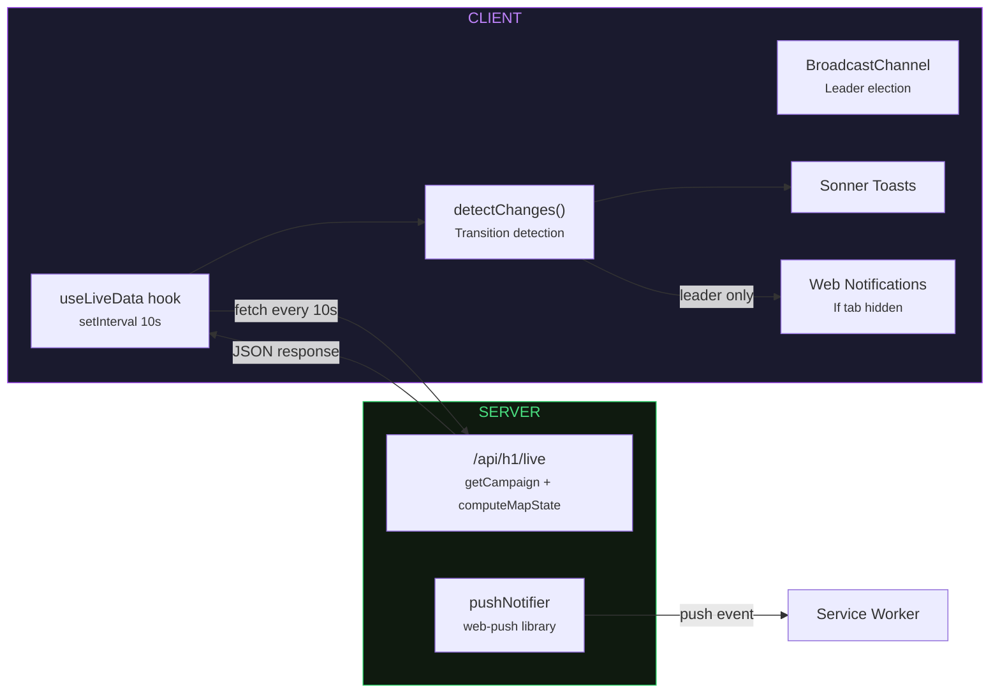

import MermaidDiagram from '@/shared/components/MermaidDiagram/MermaidDiagram';
import {
    DEFINITION_LR,
    DEFINITION_TD,
} from '@/shared/components/DataFlowDiagram/dataFlowDefinition';
import { dataFlowConfig } from '@/shared/components/DataFlowDiagram/dataFlowConfig';

export const metadata = {
    title: 'Architecture | Helldivers Bot',
    description:
        'Data flow architecture diagram for helldivers.bot — see how data moves from the official API through processing and storage to the frontend.',
    alternates: { canonical: '/docs/architecture' },
    openGraph: { url: '/docs/architecture' },
};

# Architecture

## Data Flow

How data moves from the official Helldivers 1 API through validation, storage, and normalization to the frontend. Click any node for details.

<MermaidDiagram
    id="data-flow"
    definition={DEFINITION_LR}
    mobileDefinition={DEFINITION_TD}
    config={dataFlowConfig}
/>

## Key Concepts

### Two-Table Strategy

Raw API responses are stored in rebroadcast tables (faithful JSON), while normalized `h1_*` tables enable filtering, joining, and aggregation. Both coexist to avoid trade-offs.

### Worker Thread

A dedicated thread polls the official API every 5-15 seconds using `setTimeout` (not `setInterval`) to prevent overlapping requests. Validates with Zod before any database writes.

### Confirm Pattern

Each update cycle creates an unconfirmed season row, writes all child data, then confirms by setting `last_updated`. This ensures partial writes are detectable.

### On-Demand Fetching

Missing seasons are fetched from the official API on first request. The `/archives` page derives available seasons from the current season number, not a database query.

### Client Polling

### PWA & Service Worker

The app runs as an installable Progressive Web App with a Serwist-powered service worker (`src/sw.js`). The SW uses network-first for HTML documents and stale-while-revalidate for static assets, ensuring the app shell loads offline while HTML always matches current build chunks. Version updates are controlled — new SWs wait for explicit client approval before activating. See [Notifications](/docs/notifications#pwa--offline) for the full update lifecycle and caching details.
