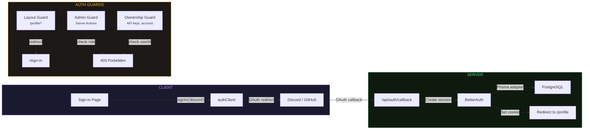
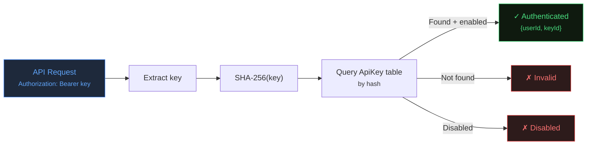

export const metadata = {
    title: 'Authentication | Helldivers Bot',
    description:
        'BetterAuth OAuth setup, sessions, roles, and API key authentication for helldivers.bot.',
    alternates: { canonical: '/docs/authentication' },
    openGraph: { url: '/docs/authentication' },
};

# Authentication

**Library:** [BetterAuth](https://www.better-auth.com/) v1.5.6
**Strategy:** OAuth-only (Discord + GitHub), database-backed sessions via Prisma adapter

---

## 1. Architecture



Authentication is split across three files:

### Server Configuration

`src/auth.js`

```js
import { betterAuth } from 'better-auth';
import { prismaAdapter } from 'better-auth/adapters/prisma';

export const auth = betterAuth({
    secret: process.env.BETTER_AUTH_SECRET,
    baseURL: process.env.BETTER_AUTH_URL,
    database: prismaAdapter(db, { provider: 'postgresql' }),
    socialProviders: {
        discord: { clientId: ..., clientSecret: ... },
        github:  { clientId: ..., clientSecret: ... },
    },
    user: {
        additionalFields: {
            role: { type: 'string', defaultValue: 'user', input: false },
        },
    },
});
```

Key points:

- Prisma adapter connects to PostgreSQL (same `db` singleton used across the app)
- `role` field added to `User` model as a custom BetterAuth field (not user-settable via input)
- No email/password or magic link authentication configured

### Client Utilities

`src/auth-client.js`

| Export       | Type     | Purpose                                                                               |
| ------------ | -------- | ------------------------------------------------------------------------------------- |
| `authClient` | Object   | BetterAuth client instance from `createAuthClient()`                                  |
| `signIn`     | Function | `signIn(provider, options?)` — triggers OAuth flow. Default `callbackURL: '/profile'` |
| `signOut`    | Function | Signs out and redirects to `/`                                                        |
| `useSession` | Hook     | React hook for accessing session in client components                                 |

### Route Handler

`src/app/api/auth/[...all]/route.js`

```js
import { toNextJsHandler } from 'better-auth/next-js';
export const { GET, POST } = toNextJsHandler(auth);
```

Delegates all `/api/auth/*` requests to BetterAuth. Handles OAuth callbacks, session management, and sign-out.

---

## 2. Session Handling

### Server-Side (Server Components & Server Actions)

```js
import { auth } from '@/auth';
import { headers } from 'next/headers';

const session = await auth.api.getSession({ headers: await headers() });
// Returns: { user: { id, name, email, image, role, banned, ... }, session: { id, token, expiresAt, ... } }
// Or: null (not authenticated)
```

Sessions are stored in the `Session` table with an opaque `token` field and `expiresAt` timestamp. BetterAuth manages session cookies automatically.

### Client-Side (Client Components)

```js
'use client';
import { useSession } from '@/auth-client';

function MyComponent() {
    const { data: session, isPending } = useSession();
    // session?.user.name, session?.user.role, etc.
}
```

### Session Revocation

```js
await auth.api.revokeSession({ headers: await headers() });
```

Used in the profile layout to revoke sessions for banned users.

---

## 3. Auth Guard Patterns

### Layout Guard (Protected Routes)

`src/app/profile/layout.jsx`

```js
const session = await auth.api.getSession({ headers: await headers() });

if (!session || !session.user) {
    redirect('/sign-in');
}

if (session.user.banned) {
    await auth.api.revokeSession({ headers: await headers() });
    redirect('/');
}
```

All `/profile/*` routes are protected by this layout. Unauthenticated users are redirected to `/sign-in`. Banned users have their session revoked and are redirected to `/`.

### Admin Guard (Server Actions)

`src/db/queries/admin.mjs`

```js
async function requireAdmin() {
    const session = await auth.api.getSession({ headers: await headers() });
    if (!session || !session.user) return { error: 'Not authenticated' };
    if (session.user.role !== 'admin') return { error: 'Forbidden' };
    return { user: session.user };
}
```

Used by all admin server actions (`getAllUsers`, `updateUserRole`, `toggleUserBan`, etc.). Returns `{ user }` on success or `{ error }` on failure.

### Ownership Guard (Server Actions)

`src/db/queries/account.mjs`, `src/db/queries/api.mjs`

```js
const session = await auth.api.getSession({ headers: await headers() });
if (!session || !session.user) return { errors: { auth: 'Not authenticated' } };
if (session.user.id !== userId) return { errors: { auth: 'Not authorized' } };
```

Ensures users can only act on their own resources (API keys, account data).

---

## 4. Sign-In / Sign-Out Flow

### Sign-In

`src/app/sign-in/page.jsx` — client component with Discord and GitHub OAuth buttons.

**Flow:**

1. User clicks "Sign in with Discord" or "Sign in with GitHub"
2. `signIn('discord')` from `@/auth-client` calls `authClient.signIn.social({ provider: 'discord', callbackURL: '/profile' })`
3. BetterAuth redirects to the provider's OAuth consent page
4. On approval, provider redirects to `/api/auth/callback/discord`
5. BetterAuth creates/links the `Account`, creates a `Session`, sets the session cookie
6. User is redirected to the `callbackURL` (defaults to `/profile`)

### Sign-Out

`src/shared/components/Auth/Auth.jsx` — `<SignIn>` and `<SignOut>` button components.

**Flow:**

1. User clicks "Sign out" in the header
2. `signOut()` from `@/auth-client` calls `authClient.signOut()` with `onSuccess` redirect to `/`
3. BetterAuth revokes the session and clears the cookie

### Navigation Integration

`src/shared/components/Navigation/Navigation.jsx` is a server component that checks the session at request time. When authenticated, it renders the user's avatar and a `<SignOut>` button. When unauthenticated, it renders a `<SignIn>` button.

---

## 5. Role System

| Role    | Access                                             |
| ------- | -------------------------------------------------- |
| `user`  | Profile, API keys, reviews, account actions        |
| `admin` | Everything above + admin section on the profile page (`/profile`) |

Roles are stored in `User.role` (string, default `"user"`). Admins can change roles via `updateUserRole()` but cannot demote themselves. The admin section on the profile page is conditionally rendered when `session.user.role === 'admin'`.

---

## 6. API Key Authentication

API keys provide a separate authentication mechanism for the `/api/h1/rebroadcast` endpoint. They are independent of BetterAuth sessions.

`src/db/queries/validateApiKey.mjs`



**Flow:**

1. Client sends `Authorization: Bearer <key>` header
2. `validateApiKey()` extracts the key, computes `SHA-256(key)`
3. Looks up the hash in the `ApiKey` table
4. Returns `{ userId, keyId }` on success, or error state (`'missing'`, `'invalid'`, `'disabled'`)

**Management:** Users can create (max 5), enable/disable, and delete API keys from their profile dashboard. The plaintext key is shown once at creation and never stored.

See [API Reference](/docs/api) section 4 for the rebroadcast endpoint's full authentication flow.

---

## 7. Environment Variables

Auth is **optional** — if `BETTER_AUTH_SECRET` is absent, all auth features are disabled (no sign-in UI, `/profile` redirects to home, auth API returns 503). If `BETTER_AUTH_SECRET` is present, all other auth vars are required (partial config throws at startup).

| Variable              | Required         | Description                                                               |
| --------------------- | ---------------- | ------------------------------------------------------------------------- |
| `BETTER_AUTH_SECRET`  | No (all-or-none) | Session encryption secret (128+ chars). Controls whether auth is enabled. |
| `BETTER_AUTH_URL`     | If auth enabled  | Base URL (e.g., `http://localhost:3000`)                                  |
| `AUTH_DISCORD_ID`     | If auth enabled  | Discord OAuth app client ID                                               |
| `AUTH_DISCORD_SECRET` | If auth enabled  | Discord OAuth app client secret                                           |
| `AUTH_GITHUB_ID`      | If auth enabled  | GitHub OAuth app client ID                                                |
| `AUTH_GITHUB_SECRET`  | If auth enabled  | GitHub OAuth app client secret                                            |

**When auth is disabled:**

- `src/auth.js` exports `auth = null` (BetterAuth is never initialized)
- `/api/auth/*` returns 503 `{ error: "Auth is not configured on this instance" }`
- `/profile/*` routes redirect to `/`
- `UserSection` is not rendered in the navigation (server component guard)
- Query files (`admin.mjs`, `account.mjs`, `api.mjs`) return early with `{ error: 'Auth not configured' }`

See [Infrastructure](/docs/infrastructure) section 5 for the complete environment variable reference.

---

## 8. Migration Notes

The project migrated from NextAuth.js v5 (beta) to BetterAuth in v0.25.0 (2026-04-04). Key changes:

| Aspect               | NextAuth.js v5                   | BetterAuth                                          |
| -------------------- | -------------------------------- | --------------------------------------------------- |
| Route handler path   | `/api/auth/[...nextauth]`        | `/api/auth/[...all]`                                |
| Server session       | `auth()` (direct call)           | `auth.api.getSession({ headers: await headers() })` |
| Client auth          | Server actions                   | Client-side via `authClient.signIn.social()`        |
| Env: secret          | `AUTH_SECRET`                    | `BETTER_AUTH_SECRET`                                |
| Env: trust host      | `AUTH_TRUST_HOST` (required)     | Not needed                                          |
| Env: base URL        | Not needed                       | `BETTER_AUTH_URL`                                   |
| Account fields       | `provider` / `providerAccountId` | `providerId` / `accountId`                          |
| Session token field  | `sessionToken`                   | `token`                                             |
| Session expiry field | `expires`                        | `expiresAt`                                         |
| Verification model   | `VerificationToken` (no PK)      | `Verification` (has `id` PK)                        |
| WebAuthn             | `Authenticator` model            | Removed                                             |
| Email auth           | Nodemailer (commented out)       | Removed entirely                                    |

**Breaking:** The migration dropped and recreated all auth tables. Existing users, sessions, and API keys were lost.

---

## Cross-References

- [Database Schema](/docs/database) section 5 — auth model field definitions and constraints
- [API Reference](/docs/api) section 9 — auth route endpoints
- [Infrastructure](/docs/infrastructure) section 5 — environment variables
