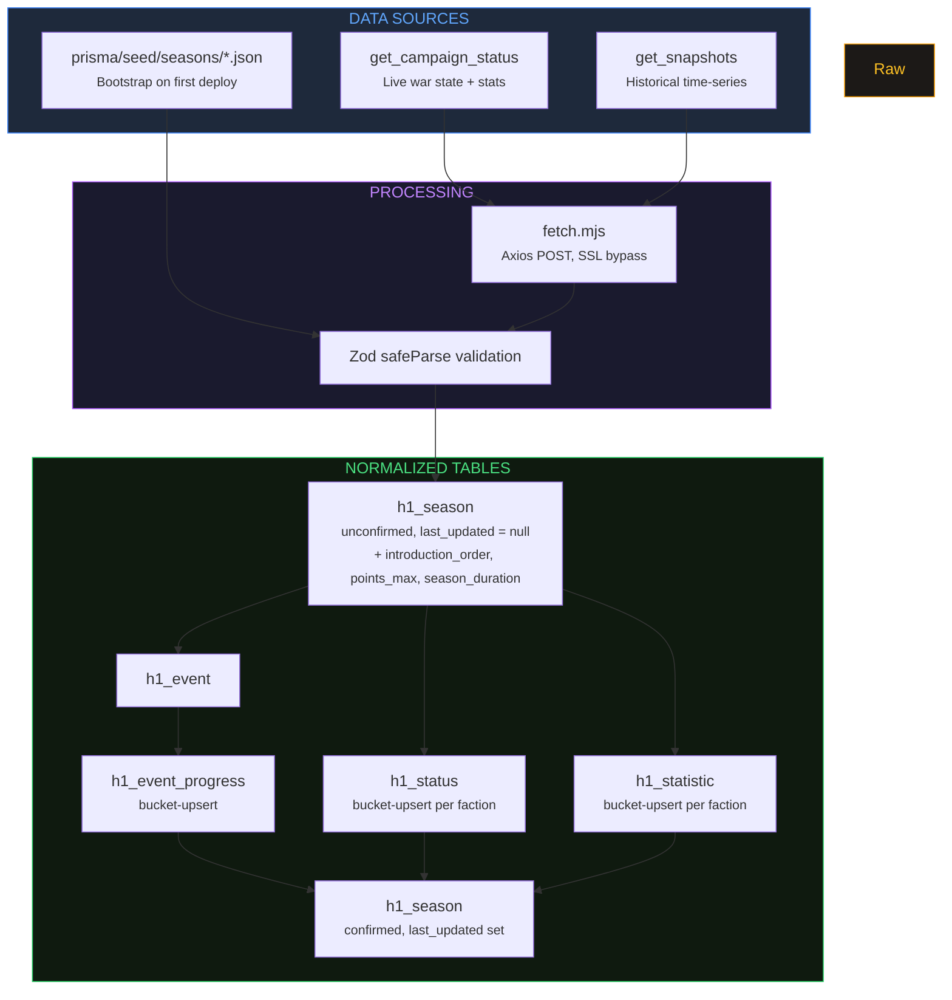
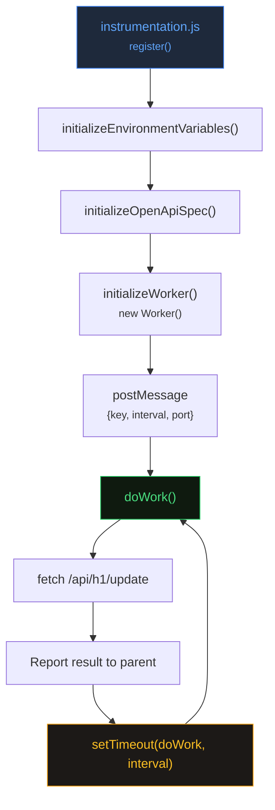

export const metadata = {
    title: 'Data Flow | Helldivers Bot',
    description:
        'Worker pipeline, two-table strategy, snapshot throttling, and data fetching architecture for helldivers.bot.',
    alternates: { canonical: '/docs/data-flow' },
    openGraph: { url: '/docs/data-flow' },
};

# Data Flow

Technical reference for how the helldivers.bot application fetches, validates, and persists data from the official Helldivers 1 API.

---

## 1. Overview

The full data pipeline from external API to stored records:



<details>
<summary>Text version of the pipeline</summary>

```
Official API (api.helldiversgame.com)
    |
    v
src/update/fetch.mjs          — HTTP layer (Axios POST, SSL bypass)
    |
    v
src/validators/               — Zod safeParse validation
    |
    v
h1_season (unconfirmed)       — Season record, last_updated = null
                                 + introduction_order, points_max, season_duration
    |
    v  [sequential]
h1_event                      — Unified defend/attack events
h1_event_progress             — Event progress (bucket-upsert)
h1_status                     — Per-faction campaign state (bucket-upsert)
h1_statistic                  — Per-faction statistics (bucket-upsert)
    |
    v
h1_season (confirmed)         — last_updated set only after all child writes succeed
```

</details>

There are two distinct pipelines that share this shape:

- **Status pipeline** (`updateStatus()`) — runs on every worker tick, updates the current campaign state. Writes `h1_season` (with inlined metadata), `h1_event`, `h1_event_progress`, `h1_status`, and `h1_statistic`. All timeseries tables use a tumbling-window bucket-upsert pattern.
- **Season pipeline** (`updateSeason(season)`) — runs on-demand when historical season data is needed. Writes `h1_season` (with inlined metadata), `h1_event`, and `h1_status`.

---

## 2. Worker Thread Lifecycle

Sources: `public/workers/cron.js`, `src/utils/initialize.worker.mjs`

### Startup



`initializeWorker()` is called from `src/instrumentation.js` during application bootstrap. It guards against non-Node.js runtimes before doing anything:

```js
if (process.env.NEXT_RUNTIME === 'nodejs') { ... }
```

This prevents the worker from being spawned in edge runtimes or during static builds.

The worker script path is resolved differently depending on environment:

| Environment              | Resolved path                                           |
| ------------------------ | ------------------------------------------------------- |
| `development`            | `path.resolve(process.cwd(), 'public/workers/cron.js')` |
| `production` / `staging` | `path.resolve('/app/public/workers/cron.js')`           |

After spawning, the parent sends a single initialization message to the worker:

```js
worker.postMessage({ key: key, interval: interval, port: port });
```

### Worker message loop

The worker listens for exactly one message from the parent. On receipt, it immediately starts the polling loop:

```js
parentPort.on('message', async (msg) => {
    const { key, interval, port } = msg;
    async function doWork() { ... }
    doWork();
});
```

`doWork()` constructs the internal update URL and fetches it:

```js
const url = `http://localhost:${port}/api/h1/update?key=${key}`;
const response = await fetch(url);
```

After each attempt — success or failure — the worker reports back to the parent:

- Success: `{ data: responseJson, time: new Date().toString() }`
- Error: `{ error: err.toString(), time: new Date().toString() }`

Errors do not stop the worker. The loop continues unconditionally.

### Sequential scheduling with `setTimeout`

The worker uses `setTimeout(doWork, interval * 1000)` at the end of `doWork()`, not `setInterval`. This is intentional: the next poll only starts after the current one fully resolves. If an update takes longer than the configured interval, requests will not overlap and database operations will not race.

### Parent-side message handling

The parent logs errors from worker messages and thread-level errors:

```js
worker.on('message', (data) => {
    if (data.error) console.error('Worker error:', data.error, 'at', data.time);
});
worker.on('error', (err) => console.error('Worker thread error:', err));
worker.on('exit', (code) => {
    console.log(`Worker stopped with exit code ${code}`);
    worker = null;
});
```

### Graceful shutdown

On `SIGINT` or `SIGTERM`, the parent terminates the worker before exiting:

```js
process.on('SIGINT', async () => {
    if (worker) await worker.terminate();
    process.exit();
});
```

---

## 3. Status Update Pipeline

Source: `src/update/status.mjs` — `updateStatus()`

This function is invoked by `GET /api/h1/update?key=...` on every worker tick. It fetches the current campaign state and persists it to both table families.

### Step-by-step

**Step 0 — Timing**

```js
const start = performance.now();
```

Execution time is measured from the very start and returned in the response as `ms`.

**Step 1 — Fetch**

```js
const { data: fetchedData, error: fetchedError } = await tryCatch(fetchStatus());
```

`fetchStatus()` POSTs `action=get_campaign_status` to the official API. It delegates to `fetchInvalidHttps()`, which throws on network failure or empty response. `tryCatch()` catches any thrown error and returns it in `error`. If `fetchedError` is set, `updateStatus()` throws immediately with a descriptive message and a `cause` pointing to the source location.

**Step 2 — Zod validation**

```js
const check = isValidStatus(fetchedData);
if (!check.success) throw new Error(...);
```

`isValidStatus` runs a Zod `safeParse` against the response. It validates the shape of `campaign_status[]`, `defend_event`, `attack_events[]`, and `statistics[]`. Validation failure throws before any database write occurs.

**Step 3 — Extract season**

```js
const season = getSeasonFromStatus(fetchedData);
```

`getSeasonFromStatus` reads the season number from `campaign_status`, `defend_event`, and `statistics`. It logs a warning if multiple different season values are present across those fields. Attack events are deliberately excluded here because they can belong to a prior season while the rest of the payload belongs to the current one.

**Step 4 — Create unconfirmed season record with inlined metadata**

```js
await tryCatch(queryUpsertSeason(season, false, { introOrder, pointsMax, seasonDuration }));
```

A row for this season is created in `h1_season` with `last_updated` left as `null` and the season-level metadata (`introduction_order`, `points_max`, `season_duration`) inlined directly on the row. The `false` parameter signals that this is the initial, unconfirmed creation. See the Confirm Pattern section below.

**Step 6 — Upsert events**

```js
// Defend event (guard for null — API omits when no defend active)
if (fetchedData.defend_event) {
    await tryCatch(queryUpsertEvent(season, 'defend', fetchedData.defend_event));
}

// Attack events
for (const event of fetchedData.attack_events) {
    await tryCatch(queryUpsertEvent(season, 'attack', { ...event, region: 11 }));
}
```

Both defend and attack events are written through the unified `queryUpsertEvent(season, type, event)` function to the `h1_event` table. Key differences:

- `defend_event` is a single nullable object in the API response. It is guarded with an `if` check — the API omits this field when no defend event is active.
- `attack_events` is an array. Each event is spread with `region: 11` added, because attack events always target the enemy homeworld (region 11) and the API does not include the region field.

Events are written sequentially, not in parallel. Each error throws immediately.

**Step 6.5 — Event progress capture (bucket-upsert)**

After upserting events, the pipeline captures time-series progress for active or terminal events:

```js
// For each defend/attack event where status is 'active', 'success', or 'fail':
await tryCatch(queryUpsertEventProgress(type, event, fetchedData.time));
```

For each active or terminal event (defend and attack), the pipeline calls `queryUpsertEventProgress()` which uses the bucket-upsert pattern: `bucket = computeBucket(time)`. Within the same bucket window, the existing row is updated with the latest `points` value. At a bucket boundary, a new row is inserted. Terminal events (`success`/`fail`) are also captured to record the final state.

Event progress errors are logged but do not throw — they are non-fatal to the pipeline.

**Step 7 — Upsert h1_status (per-faction campaign state, bucket-upsert)**

```js
for (let enemy = 0; enemy < 3; enemy++) {
    const campaign = fetchedData.campaign_status[enemy];
    await tryCatch(queryUpsertStatus(season, enemy, fetchedData.time, campaign));
}
```

The pipeline loops over the three enemy factions (0, 1, 2). For each faction, it upserts a row in `h1_status` containing the campaign data (points, points_taken, status). Uses the same bucket-upsert pattern as event progress. Map state is no longer stored in the database — `computeMapState` rebuilds it at request time from `h1_status` and `h1_event` data.

**Step 7.5 — Upsert h1_statistic (per-faction statistics, bucket-upsert)**

```js
for (let enemy = 0; enemy < 3; enemy++) {
    const stats = fetchedData.statistics[enemy];
    await tryCatch(queryUpsertStatistic(season, enemy, fetchedData.time, stats));
}
```

For each faction, the pipeline upserts a row in `h1_statistic` with the 11 per-faction statistics fields. Same bucket-upsert pattern. Statistic errors are logged but do not throw — they are non-fatal.

**Step 9 — Confirm season**

```js
await tryCatch(queryUpsertSeason(season, true));
```

`last_updated` is set only now, after all child writes have succeeded. See the Confirm Pattern section below.

**Return value**

```js
return { ms, season, confirmSeason };
```

`ms` is the raw execution time in milliseconds (via `performanceTime(start)`, not rounded). `confirmSeason` is the updated `h1_season` record.

### Confirm pattern

`queryUpsertSeason` is called twice in every pipeline run:

| Call                               | Parameter | Effect                                                             |
| ---------------------------------- | --------- | ------------------------------------------------------------------ |
| `queryUpsertSeason(season, false)` | `false`   | Creates or touches the season row; leaves `last_updated` as `null` |
| `queryUpsertSeason(season, true)`  | `true`    | Sets `last_updated` to the current timestamp                       |

The invariant this enforces: a season row with `last_updated !== null` has a complete, consistent set of child records. Any season row where `last_updated` is `null` was either just created and is mid-pipeline, or a previous pipeline run failed partway through. Consumers of the `h1_*` tables can filter on `last_updated IS NOT NULL` to read only confirmed seasons.

### Error handling

Every async operation is wrapped in `tryCatch()`, which returns `{ data, error }` instead of throwing. Errors surface as explicit `if (someError) throw new Error(...)` checks after each step, with a `cause` field that identifies the exact source file and operation. This makes stack traces actionable without relying on implicit propagation.

The exception is event progress and statistic writes (Steps 6.5 and 7.5), which log errors with `console.error` instead of throwing. These failures are non-fatal — the pipeline completes and confirms the season even if individual bucket-upserts fail to write.

---

## 4. Season Snapshot Pipeline

Source: `src/update/season.mjs` — `updateSeason(season)`

This function fetches the full historical snapshot data for a given season number. It is structurally similar to the status pipeline but operates on different data and does not write live state or throttled snapshots.

### Step-by-step

**Step 0 — Guard and timing**

```js
if (!season) throw new Error('season is missing');
const start = performance.now();
```

Season is required. If absent, the function throws before attempting any I/O.

**Step 1 — Fetch**

```js
const { data: fetchedData, error: fetchedError } = await tryCatch(fetchSeason(season));
```

`fetchSeason` validates the season parameter with `isValidNumber.safeParse`, then POSTs `action=get_snapshots` with `season=N`. Unlike `fetchStatus`, `fetchSeason` delegates directly to `fetchInvalidHttps` which re-throws on error — a failed season fetch is always a hard failure.

**Step 2 — Zod validation**

```js
const check = isValidSeason(fetchedData);
```

Validates the snapshot response shape. On failure, the individual Zod issues are logged before throwing.

**Step 3 — Cross-check season**

```js
const season2 = getSeasonFromSnapshot(fetchedData);
if (season !== season2) throw new Error('Invalid season');
```

The season number embedded in the response payload is compared against the requested season. A mismatch throws immediately, preventing data from being stored under the wrong season key.

**Step 4 — Create unconfirmed season record with inlined metadata**

```js
await tryCatch(queryUpsertSeason(season, false, {
    introOrder: fetchedData.introduction_order,
    pointsMax: fetchedData.points_max,
    seasonDuration: fetchedData.season_duration,
}));
```

Same confirm pattern as the status pipeline. Season-level metadata is inlined directly on the `h1_season` row.

**Step 5 — Upsert h1_status from snapshots**

```js
for (const snap of fetchedData.snapshots) {
    for (let enemy = 0; enemy < 3; enemy++) {
        const campaign = snap.campaign_status[enemy];
        await tryCatch(queryUpsertStatus(season, enemy, snap.time, campaign));
    }
}
```

Each historical snapshot's per-faction campaign data is upserted into `h1_status` using the same bucket-upsert pattern as the status pipeline. This populates the campaign timeseries from archived data.

**Step 5.5 — Upsert defend events**

```js
for (const event of fetchedData.defend_events) {
    await tryCatch(queryUpsertEvent(season, 'defend', event));
}
```

Defend events are iterated and each is written to `h1_event` via the unified `queryUpsertEvent` function. In the season pipeline, `defend_events` is an array (plural) because snapshot data contains full historical event lists rather than a single current event.

**Step 5.6 — Upsert attack events**

```js
for (const event of fetchedData.attack_events) {
    await tryCatch(queryUpsertEvent(season, 'attack', { ...event, region: 11 }));
}
```

Attack events are also iterated individually. Each event is spread with `region: 11` added, same as in the status pipeline.

**Step 6 — Confirm season**

```js
await tryCatch(queryUpsertSeason(season, true));
```

**Return value**

```js
return { ms, season, confirmSeason };
```

### On-demand invocation

`updateSeason()` is not called on a schedule. It is called reactively by API handlers when they cannot find the requested season in the local database:

- `GET /api/h1/campaign?season=N` — queries local `h1_*` tables first; calls `updateSeason(season)` if the season is missing.
- `POST /api/h1/rebroadcast` with `action=get_snapshots` — reconstructs the response on demand from `h1_*` tables; calls `updateSeason(season)` if the season data is absent.

After `updateSeason()` returns, the handler re-queries the database and returns the result. This means a cold request for an unknown season incurs one extra round-trip to the official API before responding.

### Frontend on-demand fetching

The `/archives` history page also fetches seasons on-demand via `updateSeason()` — the same shared pipeline the worker uses. When a user selects a season not yet in the database:

1. `getCampaign(season)` returns `null`
2. `updateSeason(season)` calls `fetchSeason(season)` (official API) and upserts into `h1_season` (with inlined metadata), `h1_event`, and `h1_status`
3. `getCampaign(season)` is re-queried and now returns the seeded data

The season selector on `/archives` is derived from the current season number (`Array.from({length: activeSeason - 1}, ...)`), not from a database query. This ensures all past seasons are always selectable regardless of what exists in the DB.

### Season transition closing pass

When the HD1 API transitions from one season to the next, it writes one final "closing" snapshot to the old season's history a few minutes after the transition point. The worker's `/api/h1/update` route tracks the season observed on the previous poll in module-level state (`lastSeasonObserved`). On each poll, if the current season is higher than `lastSeasonObserved`, the route runs `updateSeason(lastSeasonObserved)` once before processing the current season — this captures the closing snapshot that would otherwise be missed as the worker's focus moves to the new season.

The closing pass is non-fatal on error (the current season's update is more critical) and is scoped to the single transition event; it does not re-run on subsequent polls. The module-level state resets on worker restart, so a restart exactly during the tiny transition window will miss one closing snapshot — recoverable via the admin refresh button on `/archives?season=N`.

---

## 5. Table Strategy

All data is stored in normalized relational tables using the `h1_*` prefix. There are five tables total.

### H1 tables

| Table               | Relationship                               | Written by           |
| ------------------- | ------------------------------------------ | -------------------- |
| `h1_season`         | Root; one row per season (+ inlined arrays)| Both pipelines       |
| `h1_event`          | Many per season (defend + attack unified)  | Both pipelines       |
| `h1_event_progress` | Many per event (bucket-upsert)             | Status pipeline only |
| `h1_status`         | Many per season (bucket-upsert per faction)| Both pipelines       |
| `h1_statistic`      | Many per season (bucket-upsert per faction)| Status pipeline only |

These tables store normalized, relational data keyed on `season`. They accumulate historical records across every update cycle, enabling structured queries, aggregations, and time-series analysis. They are used by the `/api/h1/campaign` endpoint, the `/api/h1/rebroadcast` endpoint (which reconstructs the official API format on demand), and the frontend.

### Bucket-upsert pattern

All timeseries tables (`h1_status`, `h1_statistic`, `h1_event_progress`) use a tumbling-window bucket-upsert pattern. Each poll computes `bucket = floor(poll_time / BUCKET_SIZE) * BUCKET_SIZE` via `computeBucket()` from `src/update/bucketing.mjs`. Within an active bucket window, subsequent polls UPDATE the existing row. At a bucket boundary, a new row is INSERTed. `BUCKET_SIZE` is configurable via env var (default 900 = 15 min). This replaces the previous in-memory snapshot throttle system with deterministic, stateless bucket math.

---

## 6. Bucketing System

Source: `src/update/bucketing.mjs`

The status pipeline runs on every worker tick (typically every few seconds), but writing a new row on every tick would generate excessive data. The bucketing system controls write granularity using deterministic bucket math — no in-memory state or database cold-start queries needed.

### How it works

```js
const BUCKET_SIZE = parseInt(process.env.BUCKET_SIZE ?? '', 10) || 900; // 15 min default

function computeBucket(pollTime) {
    return Math.floor(pollTime / BUCKET_SIZE) * BUCKET_SIZE;
}
```

Each query function (`queryUpsertStatus`, `queryUpsertStatistic`, `queryUpsertEventProgress`) calls `computeBucket(time)` and uses the result as part of the unique constraint key. Prisma's `upsert` handles the rest:

- **Within a bucket window:** the existing row is UPDATEd with latest values.
- **At a bucket boundary:** a new row is INSERTed.

### Configuration

| Setting       | Default | Env var       | Notes                                               |
| ------------- | ------- | ------------- | --------------------------------------------------- |
| `BUCKET_SIZE` | `900`   | `BUCKET_SIZE` | Seconds per bucket window. Parsed once at module load. |

### Advantages over the previous throttle system

The previous `snapshotTimers.mjs` module maintained in-memory timestamps with database cold-start fallbacks. The bucket-upsert approach eliminates all of that complexity:

- **Stateless:** No in-memory state to lose on restart. No cold-start database queries.
- **Deterministic:** The same `(entity, time)` input always maps to the same bucket. No race conditions.
- **Idempotent:** Re-processing the same data (e.g., during backfill) safely upserts into existing rows.

---

## 7. Fetching Layer

Source: `src/update/fetch.mjs`

### `getApiURL()`

Returns the base URL for all environments:

| `NODE_ENV`    | URL                                   |
| ------------- | ------------------------------------- |
| `development` | `https://api.helldiversgame.com/1.0/` |
| `staging`     | `https://api.helldiversgame.com/1.0/` |
| `production`  | `https://api.helldiversgame.com/1.0/` |

All three environments target the same production API. A commented-out QA URL (`api-qa.helldiversgame.com`) exists in the source but is not active.

### `fetchInvalidHttps(url, formData)`

The core HTTP function used by both public fetchers. It creates an `https.Agent` with SSL certificate validation disabled:

```js
const agent = new https.Agent({ rejectUnauthorized: false });
```

This is required because the official Helldivers 1 API has certificate issues that would otherwise cause every request to fail. The agent is passed to Axios on every call.

The function uses `axios.post`. It throws in two cases:

- The response has no `data` field.
- Axios itself throws (network failure, non-2xx status, etc.) — the Axios error is wrapped with the HTTP status and message included.

### `fetchStatus()`

```js
export async function fetchStatus() { ... }
```

Posts `action=get_campaign_status`. Delegates directly to `fetchInvalidHttps` and returns the result. On error, the exception propagates to the caller (`updateStatus`) which handles it via `tryCatch`.

### `fetchSeason(season)`

```js
export async function fetchSeason(season) { ... }
```

Validates `season` with `isValidNumber.safeParse` before constructing the request. Posts `action=get_snapshots` with `season=N`. On validation failure, throws immediately before making any network request. On network error, the exception propagates from `fetchInvalidHttps`.

---

## Cross-references

- See [Database Schema](/docs/database) for table structures and column definitions.
- See [Notifications](/docs/notifications) for the live data polling, toast notifications, and push notification systems that consume the update pipeline's output. The frontend polls `GET /api/h1/live` every 10 seconds via the `useLiveData` hook.
- See [API Reference](/docs/api) for the `/api/h1/update` endpoint that triggers the status pipeline on each worker tick, and `/api/h1/live` for the polling endpoint that serves live data to clients.
- See [Utilities](/docs/utilities) for `tryCatch`, `getSeasonFromStatus`, `getSeasonFromSnapshot`, and the Zod validation schemas.
