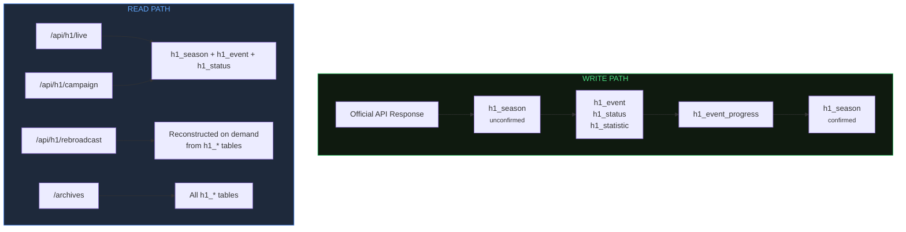

export const metadata = {
    title: 'Database Schema | Helldivers Bot',
    description:
        'Prisma 7 schema reference — models, relationships, indexes, and constraints for helldivers.bot.',
    alternates: { canonical: '/docs/database' },
    openGraph: { url: '/docs/database' },
};

# Database Schema

This document is the canonical reference for the PostgreSQL schema managed by Prisma. It covers every model, field, constraint, and index. Cross-references to data flow and API behaviour are noted inline.

---

## 1. Schema Configuration

Prisma 7 separates schema definition from connection configuration. The schema file (`prisma/schema.prisma`) defines the provider and generator. The connection URL lives in `prisma.config.mjs`.

### Schema file

```prisma
datasource db {
    provider = "postgresql"
}

generator client {
    provider = "prisma-client"
    output   = "../src/generated/prisma"
}
```

| Setting       | Value                     | Notes                                                            |
| ------------- | ------------------------- | ---------------------------------------------------------------- |
| Provider      | `postgresql`              | Connection URL configured externally in `prisma.config.mjs`      |
| Generator     | `prisma-client`           | Prisma 7 standard generator (replaces legacy `prisma-client-js`) |
| Client output | `../src/generated/prisma` | Import path: `@/generated/prisma/client`                         |

### Connection configuration (`prisma.config.mjs`)

```js
import 'dotenv/config';
import { defineConfig, env } from 'prisma/config';

export default defineConfig({
    schema: 'prisma/schema.prisma',
    migrations: { path: 'prisma/migrations' },
    datasource: { url: env('POSTGRES_URL') },
});
```

This file is read by the Prisma CLI for migrations and introspection. The `dotenv/config` import loads `.env` for local CLI usage; in Docker, `POSTGRES_URL` is injected as a real environment variable.

### Runtime client (`src/db/db.js`)

Prisma 7 requires a JavaScript driver adapter instead of the Rust query engine. The project uses `@prisma/adapter-pg` (which bundles `pg` internally):

```js
import { PrismaClient } from '@/generated/prisma/client';
import { PrismaPg } from '@prisma/adapter-pg';

const prismaClientSingleton = () => {
    const adapter = new PrismaPg({ connectionString: process.env.POSTGRES_URL });
    return new PrismaClient({ adapter });
};
```

The singleton pattern caches the client on `globalThis.prismaGlobal` to survive Next.js hot reloads in development.

---

## 2. Entity Relationship Diagram

```mermaid
erDiagram
    h1_season ||--o{ h1_status : "OneSeasonToManyStatus"
    h1_season ||--o{ h1_statistic : "OneSeasonToManyStatistic"
    h1_season ||--o{ h1_event : "OneSeasonToManyEvents"
    h1_event ||--o{ h1_event_progress : "OneEventToManyProgress"

    h1_season {
        String   id                 PK
        DateTime last_updated       "nullable"
        Int      season             UK
        Int[]    introduction_order
        Int[]    points_max
        Int      season_duration
    }

    h1_event {
        String id       PK
        Int    season   FK
        String type
        Int    event_id
        Int    region
        String status
    }

    h1_status {
        String id     PK
        Int    season FK
        Int    enemy
        Int    bucket
        Int    time
        Int    points
        String status
    }

    h1_statistic {
        String id     PK
        Int    season FK
        Int    enemy
        Int    bucket
        Int    time
        BigInt kills
        BigInt deaths
    }

    h1_event_progress {
        String id       PK
        String type
        Int    event_id FK
        Int    bucket
        Int    time
        Int    points
    }

    User ||--o{ Account : "accounts"
    User ||--o{ Session : "sessions"
    User ||--o| Settings : "settings"
    User ||--o{ Review : "reviews"
    User ||--o{ ApiKey : "apiKeys"

    User {
        String   id            PK
        String   username      UK
        String   email         UK
        Boolean  emailVerified
        String   role
        Boolean  banned
        DateTime createdAt
        DateTime updatedAt
    }

    Account {
        String   id         PK
        String   userId     FK
        String   accountId
        String   providerId
        DateTime accessTokenExpiresAt
        DateTime refreshTokenExpiresAt
    }

    Session {
        String   id        PK
        String   token     UK
        String   userId    FK
        DateTime expiresAt
        String   ipAddress
        String   userAgent
    }

    Verification {
        String   id         PK
        String   identifier
        String   value
        DateTime expiresAt
    }

    Settings {
        String userId PK-FK
        Json   settings
    }

    Review {
        String  id        PK
        String  authorId  FK
        Boolean published
    }

    ApiKey {
        String  id      PK
        String  hash    UK
        String  userId  FK
        Boolean enabled
    }

    App {
        String id             PK
        String version
        Int    active_season
    }

    worker_heartbeat {
        String   worker_type PK
        DateTime last_beat
        Int      poll_duration_ms "nullable"
        String   last_error "nullable"
        DateTime started_at
        DateTime updated_at
    }

    push_subscription {
        Int      id         PK "autoincrement"
        String   endpoint   UK
        String   keys_p256dh
        String   keys_auth
        DateTime created_at
    }
```

> The former `rebroadcast_status` and `rebroadcast_snapshot` tables have been removed. The `/api/h1/rebroadcast` endpoint now reconstructs the raw API response format on demand from the normalized `h1_*` tables.

### Data Lifecycle



---

## 3. Game Data Models

### h1_season

The root anchor for all game data. Every normalised game table points back to this row via `season` (the integer game season number, not the surrogate `id`). Season-level metadata (`introduction_order`, `points_max`, `season_duration`) is inlined directly on this model rather than stored in separate tables.

| Field                | Prisma Type | PostgreSQL Type | Constraints / Notes                                                                                                                                                           |
| -------------------- | ----------- | --------------- | ----------------------------------------------------------------------------------------------------------------------------------------------------------------------------- |
| `id`                 | `String`    | `TEXT`          | `@id @default(uuid(7))` — surrogate PK, UUIDv7                                                                                                                                |
| `last_updated`       | `DateTime?` | `TIMESTAMPTZ`   | Nullable. `null` means the season row was pre-seeded but has not yet received a successful data update. Set to the current timestamp at the end of a successful update cycle. |
| `season`             | `Int`       | `INTEGER`       | `@unique` — the game season number. Used as the FK target by all child tables.                                                                                                |
| `introduction_order` | `Int[]`     | `INTEGER[]`     | `@default([])` — ordered list of planet introduction positions for the season. Indexed by faction (enemy 0, 1, 2).                                                            |
| `points_max`         | `Int[]`     | `INTEGER[]`     | `@default([])` — maximum liberation points per faction. Indexed by faction (enemy 0, 1, 2).                                                                                   |
| `season_duration`    | `Int`       | `INTEGER`       | `@default(0)` — total duration of the season in seconds.                                                                                                                      |

**Indexes:**

| Index                     | Fields       |
| ------------------------- | ------------ |
| `@@index([season])`       | season       |
| `@@index([last_updated])` | last_updated |

**Relations (outbound):**

| Relation name                  | Target model       | Cardinality |
| ------------------------------ | ------------------ | ----------- |
| `OneSeasonToManyStatus`        | `h1_status`        | one-to-many |
| `OneSeasonToManyStatistic`     | `h1_statistic`     | one-to-many |
| `OneSeasonToManyEvents`        | `h1_event`         | one-to-many |

**Design note:** Child tables reference `season` (Int) rather than the surrogate `id` (UUID). This keeps foreign keys human-readable, avoids UUID joins in queries that filter by season number, and matches the season integer used in the official API response.

---

### h1_event

A unified table that holds both attack and defend events in a single model. The `type` column discriminates between the two event kinds, eliminating the need for UNION queries across separate tables.

| Field              | Prisma Type | PostgreSQL Type | Constraints / Notes                                                                                                       |
| ------------------ | ----------- | --------------- | ------------------------------------------------------------------------------------------------------------------------- |
| `id`               | `String`    | `TEXT`          | `@id @default(uuid(7))`                                                                                                   |
| `season`           | `Int`       | `INTEGER`       | FK → `h1_season.season`                                                                                                   |
| `type`             | `String`    | `TEXT`          | `"attack"` or `"defend"` — discriminator column                                                                           |
| `event_id`         | `Int`       | `INTEGER`       | Official API event identifier                                                                                             |
| `start_time`       | `Int`       | `INTEGER`       | Unix timestamp                                                                                                            |
| `end_time`         | `Int`       | `INTEGER`       | Unix timestamp                                                                                                            |
| `region`           | `Int`       | `INTEGER`       | Actual region integer for defend events. Sentinel value `11` for attack events (attack events have no region in the API). |
| `enemy`            | `Int`       | `INTEGER`       | Enemy faction identifier                                                                                                  |
| `points_max`       | `Int`       | `INTEGER`       |                                                                                                                           |
| `points`           | `Int`       | `INTEGER`       |                                                                                                                           |
| `status`           | `String`    | `TEXT`          | `"active"`, `"success"`, or `"fail"`                                                                                      |
| `players_at_start` | `Int?`      | `INTEGER`       | Nullable. Player count when the event started. May be unavailable for older events.                                       |

**Constraints and indexes:**

| Type       | Fields             | Notes                                                              |
| ---------- | ------------------ | ------------------------------------------------------------------ |
| `@@unique` | `[type, event_id]` | Compound unique — event IDs are unique within a type               |
| `@@index`  | `[season, type]`   | Filter events by type within a season                              |
| `@@index`  | `[season, status]` | Filter events by status within a season (e.g., active events only) |
| `@@index`  | `[season, enemy]`  | Filter events by enemy faction within a season                     |

**Relations:**

| Relation name             | Target model        | Cardinality |
| ------------------------- | ------------------- | ----------- |
| `OneSeasonToManyEvents`   | `h1_season`         | many-to-one |
| `OneEventToManyProgress`  | `h1_event_progress` | one-to-many |

---

### h1_event_progress

Bucketed time-series data for individual events. Each row captures the `points` of an event within a time bucket, enabling progress-over-time visualisations. Links to `h1_event` via the compound `(type, event_id)` key. Uses the same tumbling-window bucket-upsert pattern as `h1_status` and `h1_statistic` — `points_max` is constant per event and lives on `h1_event`, so only `points` (the progression signal) is tracked here.

| Field      | Prisma Type | PostgreSQL Type | Constraints / Notes                                                       |
| ---------- | ----------- | --------------- | ------------------------------------------------------------------------- |
| `id`       | `String`    | `TEXT`          | `@id @default(uuid(7))`                                                   |
| `type`     | `String`    | `TEXT`          | `"attack"` or `"defend"` — part of FK to `h1_event`                       |
| `event_id` | `Int`       | `INTEGER`       | Part of FK to `h1_event` via `(type, event_id)`                           |
| `bucket`   | `Int`       | `INTEGER`       | `floor(poll_time / BUCKET_SIZE) * BUCKET_SIZE` — tumbling window start    |
| `time`     | `Int`       | `INTEGER`       | Latest poll time within this bucket (drifts with each upsert)             |
| `points`   | `Int`       | `INTEGER`       | Event progress at this timestamp                                          |

**Constraints and indexes:**

| Type       | Fields                      | Notes                                              |
| ---------- | --------------------------- | -------------------------------------------------- |
| `@@unique` | `[type, event_id, bucket]`  | One row per event per bucket window                |

**Relations:**

| Relation name              | Target model | Cardinality |
| -------------------------- | ------------ | ----------- |
| `OneEventToManyProgress`   | `h1_event`   | many-to-one |

---

### h1_status

Bucketed campaign timeseries. Each row captures the campaign state for one enemy faction within a time bucket. Uses a tumbling-window bucket-upsert pattern: `bucket = floor(poll_time / BUCKET_SIZE) * BUCKET_SIZE`. Within an active bucket window, subsequent polls UPDATE the existing row with latest values. At a bucket boundary, a new row is INSERTed. `BUCKET_SIZE` is configurable via env var (default 900 = 15 min).

| Field          | Prisma Type | PostgreSQL Type | Constraints / Notes                                                                                  |
| -------------- | ----------- | --------------- | ---------------------------------------------------------------------------------------------------- |
| `id`           | `String`    | `TEXT`          | `@id @default(uuid(7))`                                                                              |
| `season`       | `Int`       | `INTEGER`       | FK → `h1_season.season`                                                                              |
| `enemy`        | `Int`       | `INTEGER`       | Enemy faction identifier: `0` = Bugs, `1` = Cyborgs, `2` = Illuminate                                |
| `bucket`       | `Int`       | `INTEGER`       | `floor(poll_time / BUCKET_SIZE) * BUCKET_SIZE` — unique window start                                  |
| `time`         | `Int`       | `INTEGER`       | Latest poll time within this bucket (drifts with each upsert)                                         |
| `points`       | `Int`       | `INTEGER`       | Current liberation points                                                                            |
| `points_taken` | `Int`       | `INTEGER`       | Points taken by the enemy                                                                            |
| `status`       | `String`    | `TEXT`          | Enum-like: `"active"`, `"defeated"`, `"hidden"`                                                      |

**Constraints and indexes:**

| Type       | Fields                   | Notes                                              |
| ---------- | ------------------------ | -------------------------------------------------- |
| `@@unique` | `[season, enemy, bucket]`| One row per faction per bucket window per season   |
| `@@index`  | `[season, bucket]`       | Range queries by season and time window            |

---

### h1_statistic

Bucketed per-faction statistics timeseries. Each row captures 11 statistical fields for one enemy faction within a time bucket. Uses the same tumbling-window bucket-upsert pattern as `h1_status`. Fields that are per-season state (like `season_duration`) or derivable from other tables (like event counts) have been moved out.

| Field                      | Prisma Type | PostgreSQL Type | Constraints / Notes                                                                                  |
| -------------------------- | ----------- | --------------- | ---------------------------------------------------------------------------------------------------- |
| `id`                       | `String`    | `TEXT`          | `@id @default(uuid(7))`                                                                              |
| `season`                   | `Int`       | `INTEGER`       | FK → `h1_season.season`                                                                              |
| `enemy`                    | `Int`       | `INTEGER`       | Enemy faction identifier: `0` = Bugs, `1` = Cyborgs, `2` = Illuminate                                |
| `bucket`                   | `Int`       | `INTEGER`       | `floor(poll_time / BUCKET_SIZE) * BUCKET_SIZE` — unique window start                                  |
| `time`                     | `Int`       | `INTEGER`       | Latest poll time within this bucket (drifts with each upsert)                                         |
| `players`                  | `Int`       | `INTEGER`       | `@default(0)` — active players during measurement window                                             |
| `total_unique_players`     | `Int`       | `INTEGER`       | `@default(0)` — unique players across the season                                                     |
| `missions`                 | `Int`       | `INTEGER`       | `@default(0)` — total missions attempted                                                             |
| `successful_missions`      | `Int`       | `INTEGER`       | `@default(0)`                                                                                        |
| `total_mission_difficulty` | `Int`       | `INTEGER`       | `@default(0)` — sum of difficulty values across all missions                                         |
| `completed_planets`        | `Int`       | `INTEGER`       | `@default(0)`                                                                                        |
| `kills`                    | `BigInt`    | `BIGINT`        | `@default(0)` — cumulative enemy kills                                                               |
| `deaths`                   | `BigInt`    | `BIGINT`        | `@default(0)` — cumulative player deaths                                                             |
| `accidentals`              | `BigInt`    | `BIGINT`        | `@default(0)` — cumulative friendly-fire deaths                                                      |
| `shots`                    | `BigInt`    | `BIGINT`        | `@default(0)` — cumulative shots fired                                                               |
| `hits`                     | `BigInt`    | `BIGINT`        | `@default(0)` — cumulative shots that connected                                                      |

**Constraints and indexes:**

| Type       | Fields                    | Notes                                           |
| ---------- | ------------------------- | ----------------------------------------------- |
| `@@unique` | `[season, enemy, bucket]` | One row per faction per bucket window per season |
| `@@index`  | `[season, bucket]`        | Range queries by season and time window          |

> **BigInt fields:** `kills`, `deaths`, `accidentals`, `shots`, and `hits` use `BigInt` (PostgreSQL `BIGINT`) rather than `Int`. Helldivers cumulative counts for an active season easily exceed the 32-bit integer maximum of ~2.1 billion. When reading these values in JavaScript, Prisma returns them as native `BigInt` primitives — serialisation to JSON requires explicit conversion (e.g., `.toString()` or a custom serialiser).

---

## 4. Rebroadcast (Removed)

The former `rebroadcast_status` and `rebroadcast_snapshot` tables have been dropped. They previously cached the raw, unmodified JSON responses from the official Helldivers API as a fast-path for the `/api/h1/rebroadcast` endpoint.

The rebroadcast endpoint now reconstructs the official API response format on demand from the normalized `h1_*` tables. This eliminates the storage duplication and the need to keep raw JSON in sync with normalised data.

---

## 5. Auth and User Models

These models implement [BetterAuth](https://www.better-auth.com/) with the Prisma adapter, plus application-specific extensions. Authentication is OAuth-only (Discord and GitHub providers). See [Authentication](/docs/authentication) for architecture details.

### User

Central user record. Extended beyond the BetterAuth baseline with `username`, `role`, `banned`, and application-specific relations.

| Field           | Prisma Type | PostgreSQL Type | Constraints / Notes                                                    |
| --------------- | ----------- | --------------- | ---------------------------------------------------------------------- |
| `id`            | `String`    | `TEXT`          | `@id @default(uuid(7))`                                                |
| `name`          | `String?`   | `TEXT`          | Display name, optional                                                 |
| `username`      | `String?`   | `TEXT`          | `@unique` — intended to hold the user's Discord username               |
| `email`         | `String?`   | `TEXT`          | `@unique`                                                              |
| `emailVerified` | `Boolean`   | `BOOLEAN`       | `@default(false)` — whether the user's email is confirmed              |
| `image`         | `String?`   | `TEXT`          | Avatar URL from OAuth provider or Gravatar fallback                    |
| `role`          | `String`    | `TEXT`          | `@default("user")` — application role string, not an enum              |
| `banned`        | `Boolean`   | `BOOLEAN`       | `@default(false)` — banned users have sessions revoked on next request |
| `createdAt`     | `DateTime`  | `TIMESTAMPTZ`   | `@default(now())`                                                      |
| `updatedAt`     | `DateTime`  | `TIMESTAMPTZ`   | `@updatedAt`                                                           |

**Relations:**

| Field      | Type        | Notes                           |
| ---------- | ----------- | ------------------------------- |
| `accounts` | `Account[]` | OAuth provider accounts         |
| `sessions` | `Session[]` | Active sessions                 |
| `settings` | `Settings?` | One-to-one application settings |
| `reviews`  | `Review[]`  | Blog-style review posts         |
| `apiKeys`  | `ApiKey[]`  | API access keys                 |

---

### Account

BetterAuth OAuth account record. Links a user to an OAuth provider. Multiple providers per user are supported (e.g., both Discord and GitHub linked to one account).

| Field                   | Prisma Type | PostgreSQL Type | Constraints / Notes                                                       |
| ----------------------- | ----------- | --------------- | ------------------------------------------------------------------------- |
| `id`                    | `String`    | `TEXT`          | `@id @default(uuid(7))`                                                   |
| `userId`                | `String`    | `TEXT`          | FK → `User.id`, `onDelete: Cascade`                                       |
| `accountId`             | `String`    | `TEXT`          | Provider's identifier for this account (replaces old `providerAccountId`) |
| `providerId`            | `String`    | `TEXT`          | Provider name, e.g., `"discord"`, `"github"` (replaces old `provider`)    |
| `accessToken`           | `String?`   | `TEXT`          | `@db.Text` — OAuth access token                                           |
| `refreshToken`          | `String?`   | `TEXT`          | `@db.Text` — OAuth refresh token                                          |
| `accessTokenExpiresAt`  | `DateTime?` | `TIMESTAMPTZ`   | Access token expiry (replaces old integer `expires_at`)                   |
| `refreshTokenExpiresAt` | `DateTime?` | `TIMESTAMPTZ`   | Refresh token expiry                                                      |
| `idToken`               | `String?`   | `TEXT`          | `@db.Text` — OIDC identity token                                          |
| `scope`                 | `String?`   | `TEXT`          | OAuth scopes granted                                                      |
| `password`              | `String?`   | `TEXT`          | Unused — present for BetterAuth email/password auth (not configured)      |
| `createdAt`             | `DateTime`  | `TIMESTAMPTZ`   | `@default(now())`                                                         |
| `updatedAt`             | `DateTime`  | `TIMESTAMPTZ`   | `@updatedAt`                                                              |

**Indexes:** `@@index([userId])`

> Unlike the previous NextAuth.js schema, `userId` no longer has a `@unique` constraint. BetterAuth allows multiple OAuth accounts per user, enabling users to link both Discord and GitHub.

---

### Session

BetterAuth database session. Each row represents an active session with metadata.

| Field       | Prisma Type | PostgreSQL Type | Constraints / Notes                                            |
| ----------- | ----------- | --------------- | -------------------------------------------------------------- |
| `id`        | `String`    | `TEXT`          | `@id @default(uuid(7))`                                        |
| `token`     | `String`    | `TEXT`          | `@unique` — opaque session token (replaces old `sessionToken`) |
| `userId`    | `String`    | `TEXT`          | FK → `User.id`, `onDelete: Cascade`                            |
| `expiresAt` | `DateTime`  | `TIMESTAMPTZ`   | Session expiry (replaces old `expires`)                        |
| `ipAddress` | `String?`   | `TEXT`          | Client IP at session creation                                  |
| `userAgent` | `String?`   | `TEXT`          | Client user agent at session creation                          |
| `createdAt` | `DateTime`  | `TIMESTAMPTZ`   | `@default(now())`                                              |
| `updatedAt` | `DateTime`  | `TIMESTAMPTZ`   | `@updatedAt`                                                   |

**Indexes:** `@@index([userId])`

---

### Verification

BetterAuth verification tokens for email verification and other confirmation flows.

| Field        | Prisma Type | PostgreSQL Type | Constraints / Notes                             |
| ------------ | ----------- | --------------- | ----------------------------------------------- |
| `id`         | `String`    | `TEXT`          | `@id @default(uuid(7))`                         |
| `identifier` | `String`    | `TEXT`          | Typically the user's email address              |
| `value`      | `String`    | `TEXT`          | Verification token value (replaces old `token`) |
| `expiresAt`  | `DateTime`  | `TIMESTAMPTZ`   | Token expiry                                    |
| `createdAt`  | `DateTime`  | `TIMESTAMPTZ`   | `@default(now())`                               |
| `updatedAt`  | `DateTime`  | `TIMESTAMPTZ`   | `@updatedAt`                                    |

**Constraints:** `@@unique([identifier, value])` — composite uniqueness on identifier + value pair.

---

### Settings

One-to-one with `User`. Stores all user preferences as a single JSON blob. Uses `userId` as both the primary key and the FK, enforcing the one-to-one relationship at the database level.

| Field      | Prisma Type | PostgreSQL Type | Constraints / Notes                                          |
| ---------- | ----------- | --------------- | ------------------------------------------------------------ |
| `userId`   | `String`    | `TEXT`          | `@id @unique` FK → `User.id`. PK and FK are the same column. |
| `settings` | `Json`      | `JSONB`         | Arbitrary user preference data                               |

---

### Review

Blog-style user-submitted content. Currently unpublished by default, suggesting a moderation workflow.

| Field       | Prisma Type | PostgreSQL Type | Constraints / Notes                                  |
| ----------- | ----------- | --------------- | ---------------------------------------------------- |
| `id`        | `String`    | `TEXT`          | `@id @default(uuid(7))`                              |
| `createdAt` | `DateTime`  | `TIMESTAMPTZ`   | `@default(now())`                                    |
| `updatedAt` | `DateTime`  | `TIMESTAMPTZ`   | `@updatedAt`                                         |
| `title`     | `String`    | `TEXT`          | Required                                             |
| `content`   | `String?`   | `TEXT`          | Optional body                                        |
| `published` | `Boolean`   | `BOOLEAN`       | `@default(false)` — requires explicit publish action |
| `authorId`  | `String`    | `TEXT`          | FK → `User.id`                                       |

---

### ApiKey

Application API keys for external consumers. A random UUID is generated as the key, SHA-256 hashed for storage. The plaintext key is shown once at creation and never stored, making the `visible` field the only partially-readable remnant.

| Field         | Prisma Type | PostgreSQL Type | Constraints / Notes                                                                          |
| ------------- | ----------- | --------------- | -------------------------------------------------------------------------------------------- |
| `id`          | `String`    | `TEXT`          | `@id @default(uuid(7))` — surrogate PK                                                       |
| `hash`        | `String`    | `TEXT`          | `@unique` — SHA-256 hash of the API key. Used for constant-time lookup on incoming requests. |
| `visible`     | `String`    | `TEXT`          | Last 4 characters of the key, for display in the dashboard (e.g., `"...a3f2"`)               |
| `userId`      | `String`    | `TEXT`          | FK → `User.id`, `onDelete: Cascade`                                                          |
| `description` | `String`    | `TEXT`          | User-provided label for the key                                                              |
| `createdAt`   | `DateTime`  | `TIMESTAMPTZ`   | `@default(now())`                                                                            |
| `enabled`     | `Boolean`   | `BOOLEAN`       | `@default(true)` — keys can be disabled without deletion                                     |

> **Security note:** SHA-256 is used as a one-way hash for key lookup. The key space is a random UUID (128 bits of entropy), which provides the actual security. The hash allows O(1) database lookups without storing the raw key. Validation logic is in `src/db/queries/validateApiKey.mjs`.

---

## 6. Push Notifications

### push_subscription

Stores Web Push API subscriptions for server-initiated push notifications. Subscriptions are anonymous (no user link required). Created via `POST /api/notifications/subscribe`, removed on unsubscribe or when the push service returns 410/404 (stale endpoint).

| Column        | Type     | Constraints        | Description                                 |
| ------------- | -------- | ------------------ | ------------------------------------------- |
| `id`          | Int      | PK, auto-increment | Sequential identifier                       |
| `endpoint`    | String   | Unique, indexed    | Push service endpoint URL (max ~2048 chars) |
| `keys_p256dh` | String   | Required           | ECDH public key (base64)                    |
| `keys_auth`   | String   | Required           | Auth secret (base64)                        |
| `created_at`  | DateTime | Default `now()`    | Subscription creation time                  |

**Relationships:** None (standalone table, not linked to User).

**Used by:** `src/update/pushNotifier.mjs` (queries all subscriptions on event transitions), `src/app/api/notifications/subscribe/route.js` (CRUD).

---

## 7. App Configuration Model

### App

A single-row configuration table for application-level state. Intended to have exactly one row at runtime.

| Field           | Prisma Type | PostgreSQL Type | Constraints / Notes                                     |
| --------------- | ----------- | --------------- | ------------------------------------------------------- |
| `id`            | `String`    | `TEXT`          | `@id @default(uuid(7))`                                 |
| `version`       | `String`    | `TEXT`          | Application version string                              |
| `active_season` | `Int`       | `INTEGER`       | `@default(0)` — the currently active game season number |

Several fields are commented out in the schema (`is_db_initialized`, `last_updated_status`, `last_updated_season`, `settings`), indicating planned but deferred functionality.

---

## 8. Worker Health

### worker_heartbeat

Single-row-per-worker health tracking table. The worker thread upserts its row on every poll cycle, enabling health checks and diagnostics. The `worker_type` string serves as both PK and discriminator (e.g., `"cron"`).

| Field              | Prisma Type | PostgreSQL Type | Constraints / Notes                                                   |
| ------------------ | ----------- | --------------- | --------------------------------------------------------------------- |
| `worker_type`      | `String`    | `TEXT`          | `@id` — worker name, e.g., `"cron"`. One row per worker type.         |
| `last_beat`        | `DateTime`  | `TIMESTAMPTZ`   | Timestamp of the most recent successful poll cycle                    |
| `poll_duration_ms` | `Int?`      | `INTEGER`       | Nullable. Duration of the last poll in milliseconds                   |
| `last_error`       | `String?`   | `TEXT`          | Nullable. Error message from the last failed poll, cleared on success |
| `started_at`       | `DateTime`  | `TIMESTAMPTZ`   | Timestamp when the worker process started                             |
| `updated_at`       | `DateTime`  | `TIMESTAMPTZ`   | `@updatedAt` — Prisma-managed timestamp                               |

**Relationships:** None (standalone table, not linked to game data or users).

**Used by:** `public/workers/cron.js` (upserts on each poll cycle), health check endpoints.

---

## 9. Index and Constraint Summary

This table enumerates every uniqueness constraint and index across the schema.

| Model                   | Constraint Type | Fields                     | Notes                                        |
| ----------------------- | --------------- | -------------------------- | -------------------------------------------- |
| `h1_season`             | `@unique`       | `season`                   | Game season number is globally unique        |
| `h1_season`             | `@@index`       | `[season]`                 |                                              |
| `h1_season`             | `@@index`       | `[last_updated]`           |                                              |
| `h1_event`              | `@@unique`      | `[type, event_id]`         | Compound unique on type + event ID           |
| `h1_event`              | `@@index`       | `[season, type]`           |                                              |
| `h1_event`              | `@@index`       | `[season, status]`         |                                              |
| `h1_event`              | `@@index`       | `[season, enemy]`          |                                              |
| `h1_status`             | `@@unique`      | `[season, enemy, bucket]`  | One row per faction per bucket per season    |
| `h1_status`             | `@@index`       | `[season, bucket]`         | Range queries by season and time window      |
| `h1_statistic`          | `@@unique`      | `[season, enemy, bucket]`  | One row per faction per bucket per season    |
| `h1_statistic`          | `@@index`       | `[season, bucket]`         | Range queries by season and time window      |
| `h1_event_progress`     | `@@unique`      | `[type, event_id, bucket]` | One row per event per bucket window          |
| `User`                  | `@unique`       | `username`               |                                              |
| `User`                  | `@unique`       | `email`                  |                                              |
| `Account`               | `@@index`       | `[userId]`               |                                              |
| `Session`               | `@unique`       | `token`                  | Opaque session token                         |
| `Session`               | `@@index`       | `[userId]`               |                                              |
| `Verification`          | `@@unique`      | `[identifier, value]`    | Composite uniqueness for verification tokens |
| `Settings`              | `@id`           | `userId`                 | PK is also the FK                            |
| `Settings`              | `@unique`       | `userId`                 | Redundant given `@id`, but explicit          |
| `ApiKey`                | `@unique`       | `hash`                   | SHA-256 hash lookup                          |
| `push_subscription`     | `@unique`       | `endpoint`               | One subscription per push endpoint           |
| `push_subscription`     | `@@index`       | `[endpoint]`             |                                              |
| `worker_heartbeat`      | `@id`           | `worker_type`            | One row per worker type                      |

---

## Cross-References

- See [Data Flow](/docs/data-flow) for the sequence in which these tables are populated during an update cycle, including the bucket-upsert pattern.
- See [API Reference](/docs/api) for the API endpoints that read from and write to these tables, including the `GET /api/h1/campaign` query shape and the rebroadcast endpoint.
