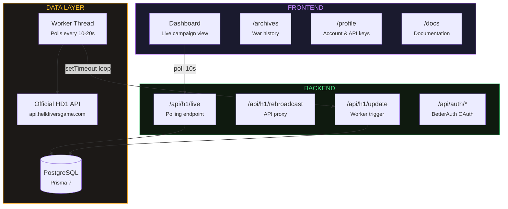

export const metadata = {
    title: 'Docs | Helldivers Bot',
    description:
        'Documentation for helldivers.bot — a community project tracking the Helldivers 1 galactic campaign.',
    alternates: { canonical: '/docs' },
    openGraph: { url: '/docs' },
};

# Documentation

Welcome to the helldivers.bot documentation. This site caches the official Helldivers 1 API, stores historic game data, and provides API access along with frontend visualizations.

## Getting Started

- [About](/docs/about) — learn about the project and its creator
- [FAQ](/docs/faq) — frequently asked questions about the war and how progress is tracked

## Architecture

- [Data Pipeline](/docs/architecture) — interactive data flow diagram and key technical concepts
- [Update Flow](/docs/data-flow) — worker pipeline, two-table strategy, and snapshot throttling
- [Database Schema](/docs/database) — Prisma 7 models, relationships, indexes, and ERD
- [Notifications](/docs/notifications) — live polling, toasts, Web Notifications, and push
- [Authentication](/docs/authentication) — BetterAuth OAuth, sessions, roles, and API keys

## Reference

- [Rebroadcast](/docs/api) — interactive OpenAPI documentation for the Helldivers Bot API
- [Utilities](/docs/utilities) — shared helpers, Zod validators, formatting, and analytics
- [Official](/docs/hd1-api) — unofficial documentation of the official Helldivers 1 API
- [Brand Kit](/docs/brandkit) — design tokens, colors, typography, and component reference

## Development

- [Infrastructure](/docs/infrastructure) — Docker, CI/CD, initialization flow, and environment variables
- [Testing](/docs/testing) — Vitest unit tests, smoke tests, and testing conventions
