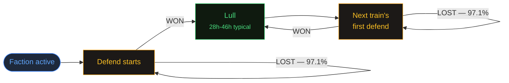

import DefendRegularityChart from './DefendRegularityChartLoader';
import LullByTrainLengthChart from './LullByTrainLengthChartLoader';
import LiveNowChip from './LiveNowChip';
import GammaExplorerSection from './GammaExplorerSection';
import LiveConcurrency from './LiveConcurrency';

export const metadata = {
    title: 'Predicting Defend Waves | Helldivers Bot',
    description:
        'How the defend-wave likelihood window was built: four modeling attempts, placebo-tested covariates, a reverse-engineered gamma scheduler with a deterministic counterattack clock, and the pre-registered gate that kept a countdown from shipping.',
    alternates: { canonical: '/docs/predict/defend' },
    openGraph: { url: '/docs/predict/defend' },
};
export const revalidate = 3600;

# Can we predict defends?

Partially — and honestly. Defend waves ride one global, hidden timer, and after four modeling attempts we can put a calibrated likelihood window on the next one, but not a countdown — except for one wave in four, the counterattack, which turns out to run on a deterministic clock. This page is the whole story: the rules of the game, attempts that measured the wrong thing or hit a wall, the placebo discipline that killed four false discoveries, and a reverse-engineering of the scheduler itself.

## How we predict it

1. We watch three observable things: whether a homeworld assault is running, whether any faction is one sector away from triggering one (`maxSC == 9`), and how long it has been since the last wave started.
2. We look up every moment across the ~160 recorded wars that looked the same — same state, same elapsed time — and read off how long the wait turned out to be (a Kaplan-Meier estimate over the state × elapsed-hours table the dashboard card ships with, so season-end censoring can't bias it short).
3. We show the 50% band and the within-24h/48h probabilities — the card reads like "likely in 14–32h · 63% within 24h", never a single number.
4. It is calibrated, verified walk-forward: the band contains the true wave at the advertised rates, within ±0.05 at every quartile.
5. It is deliberately **not** a countdown. Typical miss is ±8h on a ~44h cycle, and the pre-registered countdown bar (a skill-ratio confidence interval entirely at or under 0.6) was missed — and the miss is respected.

<LiveNowChip />

Everything below is how we earned those five lines — including the two attempts that didn't.

## The rules of the game

Before predicting anything, it pays to write down what the game will and won't do.

A "defend" is an enemy assault you either win or lose. Defends follow five rules, each confirmed against the full 160-season, 5,091-defend history — these aren't statistical tendencies, they're mechanics of the game itself.

1. **Two defends never run at the same time.** Zero overlapping pairs across 47,297 same-faction defend pairs checked.
2. **A faction never defends while you are attacking it.** Zero overlapping pairs across 9,584 same-faction defend/attack pairs checked.
3. **A defend and an attack on *different* factions can overlap.** 955 such pairs found (out of 19,756 different-faction defend/attack pairs checked) — so the constraint in rule 2 is per-faction, not global.
4. **Defends only occur while a faction is active** — never while it's `hidden` (not yet introduced) or `defeated`. *(This is a consequence of how factions work, not a discovered rule.)* 5,019 / 5,091 defends (98.6%) start with recorded status `active`; the remaining 72 (1.4%) read `hidden`, attributable to the campaign snapshot's ~1-bucket/day staleness, not real hidden-state defends. Never `defeated`.
5. **A defend train continues until the players win one.** Lose, and you get hit again almost immediately: **97.1%** of failed defends (3,112 / 3,205) chain into another defend within 10 minutes. Win, and it stops: only **0.1%** of successful defends (1 / 1,437) do the same.

   *A war ending mid-train is the minority case, not a clean second rule.* It's tempting to assume a train only ends when Super Earth is defeated and a new season starts — but the last defend of a season was itself a **failure** in just **49 of 160 seasons (30.6%)**. In the other **69.4%**, the season's final train ended with a win, and the season ended some other way.



Everything inside the train (the self-loops above) is mechanical, not a forecasting target. The only open question is how long the lull runs between one train ending and the next one starting.

The concurrency side of those rules is not a frozen claim — it is recomputed from the event log every hour, so future research (ours or yours) can cite the current census as proof rather than a snapshot. Three homeworld assaults have run simultaneously, and so have two assaults plus a defend; two defends at once has never happened, not once:

<LiveConcurrency />

There is a sixth rule, found later than the other five while working out which faction each wave targets: **a failed homeworld assault is always answered.** In every one of the 179 recorded lulls that began with a homeworld assault still running and ultimately failing, the next defend wave hit the faction that had been assaulted — 179/179, a deterministic sequencing mechanic, not a tendency. Assaults that *succeed* show the mirror image, 0/27, for the dull reason that winning removes the faction from the game. And when no assault is in play but exactly one faction sits one sector from triggering one, that faction is the likely-but-not-certain next target: 189 of 308 such lulls, 61.4%, against a within-season permutation placebo at p = 0.0005. *(reproduce: `12-faction-choice.mjs`)*

A Discord question ("is the cooldown always the same, with the defend just waiting for an appropriate time to begin?") pushed rule 6 one step further in 2026-07-31, and the answer splits it into two more rules, both sharper than the hunch:

7. **A failed assault is answered *immediately*.** Every fail-resolved homeworld assault in history ran **exactly 48.0 hours** — 544 of 544 within ±30 minutes of the timeout; assaults that succeed end early, when their points fill. And when the defend slot is free at that moment, the counterattack train starts **within 10 minutes** of the timeout: 467 of 474 cases, p05–p95 spread 0.0h. (Measured slot-aware, because queued cases genuinely wait: when two assaults fail with overlapping pending windows, the second counterattack fires ~37h late at the median — the single defend slot serializes them.) The counterattack lands on region 9 in 97.8% of cases, which also explains most of the region-9 dominance among train starts.
8. **No free wave ever starts while an assault is running.** Of 1,819 train starts, 178 began with an assault active — and all 178 are counterattacks. Zero random waves in 24,651 hours of assault-active lull time, against 34.9 starts per 1,000 hours in assault-free time. The scheduler's clock is *gated* for the duration of every assault.

*(reproduce: `14-counterattack-delta.mjs` — which also re-verifies the concurrency census and rules 7–8 on every run)*

With the rules fixed, the forecasting problem collapses to a single number: how long does the lull run? Our first attempt managed to get even the question wrong.

## Attempt 1: we measured the wrong thing

The obvious target is the gap from one defend to the next, and that is what we measured first: 4,642 defend-to-defend gaps pooled across every season. Models built on that target looked busy and went nowhere, and the reason is sitting in rule 5: **61.1% of all defends are mechanical follow-ups** — lose a defend and the next one starts within minutes, no scheduler involved. The pooled series is two different distributions stapled together: a spike at zero (the chain mechanic) and a long tail (the actual lulls).

So our first models were unknowingly predicting the chain mechanic — a thing that needs no prediction, because rule 5 already states it. Restrict to train starts — the 1,978 waves that began *without* a defend immediately preceding them — and the target changes character completely:

<DefendRegularityChart />

The pooled defend-gap series is dominated by mechanical train continuations (the mass right at zero); restricting to train starts throws those out and leaves a genuinely different, more regular distribution.

### Regularity: pooled gaps vs. train-start gaps

| Series | n | p25 | median | p75 | IQR |
| --- | --- | --- | --- | --- | --- |
| Pooled defend gaps (any defend → next) | 4,642 | 0.02h | 0.02h | 36.2h | 36.1h |
| Train-start-to-train-start gaps | 1,818 | 33.6h | 44.1h | 56.0h | 22.4h |

The pooled series is genuinely bimodal — half of it sits within minutes of zero (the mechanical chain restarts) and the other half stretches into a long tail. Restricting to train starts throws out the mechanical restarts and leaves a distribution that's both centered higher (the real ~44h cycle) and roughly 40% narrower.

The quantity that actually matters for a "once you hold, the next wave is in..." claim is the **lull** — the gap from when the previous train *ends* to when the next one *starts* (not train-start to train-start, which also includes however long the previous train itself ran):

| Quantity | n | p25 | median | p75 |
| --- | --- | --- | --- | --- |
| Lull (end of previous train → next train start) | 1,818 | 27.8h | 36.8h | 46.4h |

That lull — from the end of one train to the start of the next — is the real forecasting target. Attempt 2 predicted it honestly.

## Attempt 2: the honest baseline

The honest baseline uses no features at all. At any moment during a lull it conditions on exactly one thing — how long you have already waited — and reads the distribution of remaining waits straight off history (a forward-recurrence estimate, scored walk-forward: every season is forecast by a model that never saw it). It is the dumbest defensible model, which is precisely what makes it the right yardstick.

It is also where the pre-registered decision gate enters. Shipping a countdown required all three legs at once: calibration within ±0.05 at every quartile, a skill-ratio confidence interval entirely at or under 0.6, and a predicted band narrower than the raw spread. Here is where the baseline landed:

### Prediction accuracy

**Skill ratio**, in one sentence: it's the model's typical error divided by the typical error of always guessing one fixed number (the historical median wait) — 1.0 means the model is no better than that constant guess, and the project's ship bar requires the ratio's entire 95% confidence interval to sit at or under 0.6.

The headline model predicts train-start-to-train-start timing directly (the corrected target, after a labelling bug that pooled real train starts together with mechanical follow-ups was found and fixed):

| Configuration | Calibration | Skill ratio [95% CI] | Median abs. error vs. baseline | Sharpness (predicted band vs. marginal) | Effective N | Verdict |
| --- | --- | --- | --- | --- | --- | --- |
| Train starts, unrestricted moments | FAIL | 0.722 [0.697, 0.748] | 9.7h vs. 13.4h | 23.3h vs. 22.4h — **not narrower** | 1,466 | INCONCLUSIVE |
| **Train starts, no defend active (headline)** | **PASS** | **0.789 [0.766, 0.812]** | **9.1h vs. 11.5h** | 23.1h vs. 22.4h — **not narrower** | 1,463 | **INCONCLUSIVE** |

Calibration on the headline configuration, quartile by quartile (target vs. observed, both within the project's ±0.05 tolerance):

| Quartile | Target | Observed | Within tolerance? |
| --- | --- | --- | --- |
| p25 | 0.250 | 0.208 | Yes (off by 0.042) |
| p50 | 0.500 | 0.485 | Yes (off by 0.015) |
| p75 | 0.750 | 0.764 | Yes (off by 0.014) |

So the model is well-calibrated and clearly beats a flat guess — but it fails the **sharpness** leg of the gate (its predicted 25th–75th percentile band, 23.1h wide, is not narrower than the 22.4h spread of the raw gap distribution it's predicting) and its skill ratio, while below the "not usefully predictable" line of 0.8, sits well above the 0.6 ship bar with a tight confidence interval — this is a clean miss, not an underpowered one.

One seemingly promising feature deserves its own burial before we move on: the length of the train you just survived tells you nothing about the wait that follows.

<LullByTrainLengthChart />

The previous train's length does **not** predict how long the following lull runs — every stratum sits close to the same ~35–38h median regardless of whether the previous train was a single defend or six-plus.

### Does the previous train's length predict the wait?

No. Every stratum's lull sits close to the same ~35-38h median regardless of whether the previous train was a single defend or six-plus:

| Previous train length | n | Lull p25 | Lull median | Lull p75 |
| --- | --- | --- | --- | --- |
| 1 defend | 671 | 23.0h | 34.7h | 47.0h |
| 2 defends | 209 | 29.9h | 38.5h | 46.8h |
| 3 defends | 222 | 29.3h | 37.7h | 45.2h |
| 4 defends | 210 | 28.7h | 37.3h | 45.4h |
| 5 defends | 102 | 28.5h | 33.6h | 43.0h |
| 6+ defends | 115 | 30.7h | 38.4h | 43.2h |

Pearson correlation across the 1,529 trains above: `r = -0.004` for previous-train-length vs. lull, `r = -0.031` for previous-train-failures vs. lull — both well under the `|r| < 0.1` bar the project treats as "no detectable relationship." A separate correlation of previous-train-length against the **start-to-start** gap (not the lull) does show up at `r = 0.176`, but that's mechanical, not predictive: a longer previous train simply pushes its own end time later — and therefore the next start-to-start measurement — even when the lull that follows it is exactly as random as any other lull.

So elapsed time alone buys calibration but no sharpness. To do better, the model would have to actually see something about the world — and the world, it turns out, had already lied to us more than once.

## Attempt 3: teaching it to read the map

Attempt 3 is the one that got the closest, so here is its result up front:

**How good is the best guess we could build?** The most accurate model tested — one that watches live campaign state (see the assault-window finding below) — predicts the wait to within about **8 hours**, typically, on a cycle that runs roughly **44 hours** end to end. A model that ignores everything and always guesses the historical average wait is off by about **12 hours**. So the smart model clearly beats the dumb one — by more with every attempt — but 8 hours of typical error is still close to a fifth of the entire cycle. That's not precise enough for a shrinking countdown bar; it's precise enough to say "usually somewhere between a day and two days," which is a sentence, not a clock.

**The one conditioning fact that matters is visible on the map today:** if any faction has 9 of 10 sectors captured, the current lull is running long — the median wait in that state is ~55h against ~35h otherwise (+20h, placebo-tested, consistent across all four eras of the game's history). The mechanism is coherent with the sixth rule above and the deterministic assault trigger on <a href="/docs/predict/attack" data-umami-event="docs-predict-attack">the attack page</a>, and sharper than it first looked: 9 of 10 sectors means the faction is *inside its final sector*, with the assault firing the moment that sector completes. `SC9` is therefore the window in which an assault is pending but has not yet fired — and defend trains go quiet through it.

The reason those two paragraphs can be trusted is the placebo discipline behind them. By this point the project had accumulated four separate "we found it!" covariates — each clearing p = 0.0005, each dead on closer inspection — and every one taught the same lesson about how cross-season comparisons let the composition of wars masquerade as a mechanic:

### Why so many "we found it!" results didn't survive

The most notable false lead was `libVelocity1d` (how fast a faction had been losing ground right before a defend), which looked significant at first glance. Here's the trap the project's own control design fell into, and how it was caught.

Imagine testing whether people eat bigger dinners right before a thunderstorm. If you compare pre-storm dinners in Seattle against random, ordinary dinners in Cairo, you'll almost certainly find a difference — Seattle and Cairo just eat differently, storm or no storm. The fix is to compare like with like: pre-storm dinners in Seattle against ordinary dinners *also in Seattle*.

This project's trigger-hunt controls are built the *first* way, not the second: every comparison draws its control points from the *same fractional position in other seasons' wars* — a different war, at the same "how far into the war are we" moment. That's the Cairo mistake wearing a lab coat — different wars run at different speeds, so a war-to-war difference can look like a defend-related one. That's exactly what happened with `libVelocity1d`: against cross-season controls it clears the statistical significance bar comfortably (IQR ratio 0.832, permutation p = 0.0005 for the 1-day window). What actually caught it was a reviewer re-running the identical test with exactly one thing changed — controls drawn from the event's *own* season instead of another one — at which point the effect evaporated (IQR ratio 0.998, p = 0.4838; a one-in-two-thousand result became a coin flip). That same-season check wasn't in the committed scripts at the time — a reviewer ran it by hand. The honest lesson is that the check belongs in the code, and as of the 2026-07-28 sweep it is: `06-train-covariates.mjs` runs every test against within-season permutation controls, so a Cairo-style artifact can no longer clear that sweep's bar.

#### Second covariate sweep — train-start lulls, same-season placebos built in

The 2026-07-28 sweep (`06-train-covariates.mjs`) tested eight pre-declared covariates against the lull, every one under a **within-season** label permutation (an effect has to exist inside individual seasons to register — cross-season composition can't manufacture it) *and* a phase-stratified variant (permuting only within season × season-phase third — within-season calendar drift can't either). Bonferroni α = 0.00625, 2,000 seeded permutations:

| # | Covariate | Observable during the lull? | Within-season effect | p (plain / phase-stratified) | Verdict |
| --- | --- | --- | --- | --- | --- |
| 1 | Hour-of-day of train starts | — | χ² 32.2 (df 23), rate ratios 0.79–1.31 | 0.13 (season-rotation null) | Null — the pooled χ²=128.1 was follow-up dilution |
| 2 | Day-of-week of train starts | — | χ² 3.5 (df 6) | 0.57 | Null — no weekend effect on train starts |
| 3 | Previous train's faction | Yes | −0.7h | 0.74 / 0.94 | Null |
| 4 | Previous train's region = 9 | Yes | −0.3h | 1.00 / 1.00 | Null |
| 5 | Previous train's region = 10 | Yes | **+10.1h** | **0.0005 / 0.0005** | Real — a proxy for the assault window |
| 6 | *Next* train's region = 9 | **No** (revealed at the event) | +11.5h | 0.0005 / 0.0005 | Real structure, unusable as a feature |
| 7 | **Max sectors captured = 9** | **Yes** | **+20.3h** | **0.0005 / 0.0005** | **The assault window — the headline finding** |
| 8 | Attack active | Yes | −11.5h | 0.0005 / 0.0005 | Real (at moment level the state predicts *longer* remaining waits — it persists through long lulls) |
| — | Confound check: SC9 vs SC10 | — | +20.3h | 0.0005 | SC10 is *later* in the season yet reverts to baseline — a monotone season-phase confound cannot produce this reversal. The deterministic trigger explains why: at SC10 the assault has already fired, so the pending-assault window has closed |

Two supporting facts tie the significant rows into one mechanism: train-start region is largely a campaign-state readout (73% of train starts fire within ±1 sector of the faction's frontier), and attacks fire the instant the 10th sector completes — so rows 5, 6, and 7 are all views of the same pre-assault window. There is also **no hard cooldown floor** (minimum lull 0.09h; smooth left tail in every era) — the soft p05 drift across eras (12h → 25h) is non-stationarity, not a mechanic.

### Attempt 3: conditioning on live campaign state (2026-07-28)

A third attempt asked whether anything **observable at forecast time** shifts the lull, testing eight pre-declared covariates on the 1,978 train starts with within-season permutation placebos (see the sweep table below). Three survived — all pointing at the homeworld-assault window — and were fed into a state-conditional model: at every walk-forward moment, classify the world as `ATTACK` (an attack is running), `SC9` (some faction has exactly 9 of 10 sectors), `SC10`, or `NORMAL`, then estimate the remaining wait from the 200 nearest training moments *in that state* by elapsed time (with a Kaplan-Meier correction for season-end censoring — the plain version's calibration failure was in exactly the direction its documented censoring bias predicted, and both versions are reported):

| Configuration | Calibration | Skill ratio [95% CI] | Median abs. error | Sharpness vs. 22.4h marginal | Verdict |
| --- | --- | --- | --- | --- | --- |
| Baseline (featureless, from the table above) | PASS | 0.789 [0.766, 0.812] | 9.1h | 23.1h — not narrower | INCONCLUSIVE |
| State-conditional, plain (v1) | FAIL (all rates low) | 0.675 [0.652, 0.698] | 7.8h | 18.9h — **narrower** | INCONCLUSIVE |
| Season-pace adaptive | PASS | 0.825 [0.800, 0.851] | 9.5h | 24.2h — not narrower | NOT USEFULLY PREDICTABLE |
| **State-conditional, KM-corrected (v2)** | **PASS** | **0.679 [0.651, 0.707]** | **7.8h** | **20.4h — narrower** | **INCONCLUSIVE** |

**These defend figures moved slightly in 2026-07-30.** `forwardRecurrenceMedian` was computing the constant baseline over the *unfiltered* season span while the model was scored on filtered moments, so for any `momentFilter` configuration the skill ratio was partly measuring the filter rather than the model. Fixing it raised the filtered skill ratios by roughly 0.03–0.04 (the headline baseline from 0.753 to 0.789, the KM model from 0.648 to 0.679). No verdict changed, and the unrestricted rows are unaffected because they apply no filter. Found while building the attack forecast, which needed the same code path.

The KM configuration is the first model in this project to pass the sharpness leg, and it passes calibration — two of three gate legs, with a skill ratio a clear CI-separated step below every previous attempt. It dies on the leg the gate is strictest about: the skill-ratio CI's upper bound is 0.707 against the ≤ 0.6 ship requirement. Two caveats are disclosed with it: the winning configuration is the post-hoc best of six correlated variants (selection its CI doesn't account for — and it *still* misses), and `h1_status`'s ~daily staleness smears the state boundaries, so the true assault-window effect is likely sharper than measured — a real reason to revisit once enough high-resolution seasons (S157+, 15-minute buckets, only ~49 train starts so far) accumulate.

The season-pace row also settles an untried angle from the handoff: per-season rhythm is real but weak (adjacent-season correlation ~0.35), and an online season-adaptive predictor does **not** beat the featureless baseline.

**Verdict: INCONCLUSIVE.** Not dead — the best model now passes two of the decision gate's three legs (calibration and, for the first time, sharpness) and is a materially better guess than a flat average — but its skill still misses the pre-registered ship bar, so no countdown ships. See **In depth** below for the trigger-hunt tables, the method, and the decision gate every number on this page is measured against.

And yet a forecast ships. The KM state-conditional model passes calibration and sharpness — two of the gate's three legs — and a **band labeled as a band** never overclaims: saying "likely in 14–32h · 63% within 24h" at rates those numbers verifiably hold is honest whether or not a countdown ever becomes possible. That is exactly what the dashboard's <a href="/" data-umami-event="docs-predict-dashboard">next-wave card</a> renders, and all it renders. But knowing how well we can predict left one itch unscratched: what is the game actually *doing*?

## Reverse-engineering the scheduler

Put on a game developer's hat. Somewhere in the Helldivers 1 server there is a function that decides when the next wave fires, and although we cannot read it, every plausible design leaves a different fingerprint on the 1,819 recorded lulls. So we wrote down six designs a developer might reasonably have shipped, derived the fingerprint each would leave, and checked all six:

| Candidate design | Fingerprint it would leave | What the data says | Verdict |
| --- | --- | --- | --- |
| Coin flip every tick (memoryless) | Exponential shape, CV ≈ 1, mode at zero | CV = 0.476; KS distance 0.314 — the worst fit tested | Dead |
| Uniform roll in a window | Flat-topped histogram | KS distance 0.240 against the best-fit uniform [p05, p95] | Dead |
| Cron-style tick grid | Combs in the lull at tick multiples; round wall-clock times | No comb at any tick of 1h or coarser (χ² ≈ df); the 0.5h test shows mild non-uniformity (χ² 33.9, df 11) far short of a comb (max bin 10.2% vs 8.3% uniform); 1,978 of 1,979 train starts carry non-zero seconds | Dead |
| Three per-faction timers | Each faction's own cycle cleaner than the pooled series | Backwards: per-faction CV 0.768–0.783 vs pooled 0.447 | Dead |
| Schedule table by wave index | Lull spread changing with wave number | Flat: p50 33.2–39.1h, CV 0.43–0.52 across every wave-index stratum | Dead |
| One global end-anchored gamma delay | Right-skewed hump, CV ≈ 0.5, no combs, pooled cleaner than per-faction | KS distance **0.073** at k ≈ 4.4, θ ≈ 8.9h — three times closer than any alternative | **Survives** |

Two details pin the survivor down further. The timer anchors on the train's *end*, not its start: the correlation between a train's duration and the following lull is r = −0.027, and a start-anchored timer would force it strongly negative, because long trains would eat into their own lull. And a fixed timer — the k → ∞ corner of the gamma family — is ruled out by the same CV of 0.476; the k = 50 preset in the explorer below shows how badly it misses.

If we had to reconstruct the code, it would read (updated 2026-07-31 — the original fit, k ≈ 4.4, θ ≈ 8.9h, was made on *all* lulls, before rules 7–8 showed that ~26% of them are mechanical counterattack lulls and that the clock pauses during assaults; refit on free lulls net of assault-gated time, the delay is visibly tighter):

```
onTrainEnd(result == WIN):
    nextWaveAt = now + sampleGamma(k ≈ 8.8, θ ≈ 3.6h)   // mean ≈ 32h, CV ≈ 0.34
    // clock GATED while any homeworld assault runs (rule 8)

onAssaultTimeout(48h, result == FAIL):
    spawnDefendTrain(faction = assaulted, region = 9)    // immediately (rule 7)
```

A KS distance of 0.073 (0.077 for the decontaminated refit) does not prove the developers typed the word *gamma* — a delay built from a few exponential stages leaves the same fingerprint — but it rules out everything else on the list. This is the real lull histogram from the live database — drag k and watch the memoryless hypothesis miss (frozen tables above were computed a day earlier at 1,978 starts / 1,818 lulls — the dataset grows as wars end):

<GammaExplorerSection />

Which leaves `pickFaction()` as the one line still unexplained.

## Which faction gets hit

Mostly, the sixth rule answers it. If the lull began with a homeworld assault that goes on to fail, the next wave hits the assaulted faction — 179/179, deterministic. If the assault succeeded, that faction is gone and trivially cannot be the target (0/27). If no assault is in play but exactly one faction sits at 9 of 10 sectors, bet on it and you will be right 61.4% of the time (189/308, within-season placebo p = 0.0005).

Outside those regimes the draw is close to unpredictable. The transition matrix — computed over all 1,819 lulls, regardless of assault or SC9 state — shows a mild same-again tilt: after a Cyborg wave the next one is Cyborgs 41.0% of the time against a 36.2% base rate, with Bugs at 33.4% vs 28.8% and Illuminate at 39.8% vs 35.0%. Restricted to the honest-remainder population above (n=1,305, outside both the counterattack and SC9-window regimes), five naive per-faction rules were scored directly on that narrower set: "same faction again" comes out best at 44.3% accuracy, "majority among active-status factions" manages 42.4%, and the other three (most-overdue faction, highest liberation, majority class) land at 35–36%. Nothing rule-like survives out there.

The timing side independently confirms the drawing order: if each faction ran its own timer, per-faction cycles would look *cleaner* than the pooled series. It is the opposite — per-faction start-to-start CVs sit at 0.768–0.783 while the pooled series sits at 0.447 — so there is **one global clock**, and the faction is chosen only when the wave spawns. *(reproduce: `12-faction-choice.mjs` · `13-scheduler-shape.mjs`)*

## The counterattack clock (the third target correction)

Rules 7 and 8 are not just lore — they change what this page's models should have been predicting, for the third time. Attempt 1 unknowingly modeled the chain mechanic; the 2026-07-31 finding shows every attempt since has been unknowingly modeling the *counterattack* mechanic too: **487 of 1,979 train starts (24.6%) are counterattacks**, waves whose timing is fully determined by an assault's 48h timeout, not by the scheduler's dice. So the honest statistical target — waves the gamma clock actually draws — is the remaining 1,492.

Re-running the whole gate on that corrected series (baseline and state-model both, sharpness comparator recomputed from the corrected series' own spread):

| Configuration | Calibration | Skill ratio [95% CI] | Median abs. error | Sharpness vs. 22.0h corrected marginal | Verdict |
| --- | --- | --- | --- | --- | --- |
| Baseline (featureless, corrected target) | FAIL | 0.840 [0.793, 0.947] | 15.8h vs. 18.9h | 49.1h — not narrower | INCONCLUSIVE |
| State-conditional KM (corrected target) | FAIL | 0.625 [0.599, 0.664] | 11.8h vs. 18.9h | 47.4h — not narrower | INCONCLUSIVE |

The corrected target is *harder*, not easier: a free wave sometimes has to wait out an entire assault epoch (a 48h timeout plus the counterattack train it spawns) before the clock even resumes, which puts a long right tail on the series that no tested model turns into a calibrated narrow band. The relative skill improves (0.625 is the best ratio the project has produced) but calibration and sharpness both fail. **The verdict is unchanged through what is now a fourth attempt: INCONCLUSIVE, no countdown for free waves.**

The flip side is that the *mechanical* quarter of the target is now essentially solved. On walk-forward moments where an assault was running, predicting "the next wave lands at the assault's start + 48h" scores a **median error of 0.0h against the shipped KM table's 9.2h** (7,282 paired moments across 130 seasons, win rate 89.4%) — honestly conditional on the assault failing, which is the ~59% base-rate outcome, and known the instant the timeout passes. The same trick does *not* work one state earlier: chaining the attack-ETA model into the 48h timeout from the SC9 window is no better than the KM table (ratio 1.296, CI spanning 1), because pace-forecast noise swamps the deterministic tail. *(reproduce: `15-counterattack-target.mjs` · `16-counterattack-pipeline.mjs`)*

## What ships

The dashboard's next-wave card is the distillation of everything above, in three moves: classify the moment (ATTACK, SC9, SC10 or NORMAL — the three observables from the top of this page), look up the Kaplan-Meier remaining-wait table for that state at the current elapsed hour, and render the 50% band with its within-24h/48h probabilities — plus two badges: **imminent**, when the within-24h probability crosses its threshold, and **running long**, whenever the state is SC9 and a longer-than-usual wait is the expected outcome rather than a surprise.

Its honesty rules are hard-coded: it says *likely*, never *will*; it renders a band, never a countdown; it hides entirely while a wave is active instead of inventing precision; and the typical ±8h miss is printed on the card itself. That is the deal defends offer — a calibrated window, not a clock. (With one exception earned above: *during a homeworld assault*, "if this assault fails, the counterattack lands the moment it times out" **is** a clock — a deterministic mechanic, not a model — and surfacing it on the card is tracked as follow-up work.) Attacks offer a much better deal: a deterministic trigger and a forecast that cleared every leg of the same gate. <a href="/docs/predict/attack" data-umami-event="docs-predict-attack">That is the solved half of this report →</a>

<details>
<summary>In depth: trigger hunts, method & caveats, and reproduction</summary>

### Event counts

The static counts table that used to open this section is superseded by the live footer under the gamma explorer above (lulls, train starts and seasons, refreshed hourly). When the static analyses in this report were frozen, the record stood at **5,091 defends** across 160 seasons — **1,978 train starts (38.9%)**, the real forecasting targets, and **3,113 mechanical follow-ups (61.1%)** — plus **925 attacks**.

Train length distribution — among the 1,529 trains with both a defined predecessor and a following lull (excludes each season's first train, which has no predecessor, and any train with no successor before the season ends):

| Previous train length | n | Share |
| --- | --- | --- |
| 1 defend | 671 | 43.9% |
| 2 defends | 209 | 13.7% |
| 3 defends | 222 | 14.5% |
| 4 defends | 210 | 13.7% |
| 5 defends | 102 | 6.7% |
| 6+ defends | 115 | 7.5% |

### What was tested and rejected

#### Trigger hunt — does campaign state predict the event?

Every row compares the variable's spread (interquartile range) at real events against phase-matched controls drawn from the same fractional point in *other* seasons. A **rule-like** result requires both a large effect size (IQR ratio ≤ 0.25) *and* a permutation p-value under the Bonferroni-corrected threshold (α = 0.01 across 5 variables).

| Dataset | Variable | IQR ratio | p-value | Verdict | Why (if rejected) |
| --- | --- | --- | --- | --- | --- |
| Defends (all 5,091) | liberation | 1.087 | 1.0000 | No rule | — |
| Defends (all 5,091) | sectorsCaptured | 1.000 | 1.0000 | No rule | — |
| Defends (all 5,091) | daysIntoSeason | 1.538 | 1.0000 | No rule | — |
| Defends (all 5,091) | hoursSincePrevEventEnd | 0.354 | 0.0005 | No rule | Significant p-value, but effect size (0.354) sits above the 0.25 rule-like bar — real but too weak/diffuse to call a threshold |
| Defends (all 5,091) | playerPercentile | 1.180 | 1.0000 | No rule | — |
| Attacks (925) | liberation | **0.135** | **0.0005** | **RULE-LIKE** | Kept — see <a href="/docs/predict/attack" data-umami-event="docs-predict-attack">the attack page</a> |
| Attacks (925) | sectorsCaptured | **0.000** | **0.0005** | **RULE-LIKE** | Kept — see <a href="/docs/predict/attack" data-umami-event="docs-predict-attack">the attack page</a> |
| Attacks (925) | daysIntoSeason | 0.912 | 0.0515 | No rule | This is the control check — flat, confirming the liberation/sector signal is campaign state, not a season-calendar artifact |
| Attacks (925) | hoursSincePrevEventEnd | 0.847 | 0.0105 | No rule | Barely misses the corrected α (0.01) |
| Attacks (925) | playerPercentile | 1.004 | 0.6592 | No rule | — |
| Train starts (1,978) | liberation | 1.053 | 0.9810 | No rule | Confirms dilution hypothesis rejected — restricting to train starts didn't unmask a hidden trigger |
| Train starts (1,978) | sectorsCaptured | 1.000 | 1.0000 | No rule | — |
| Train starts (1,978) | daysIntoSeason | 1.416 | 1.0000 | No rule | — |
| Train starts (1,978) | hoursSincePrevEventEnd | 0.959 | 0.1634 | No rule | Also a definitional shift, not just dilution — see note below |
| Train starts (1,978) | playerPercentile | 1.166 | 1.0000 | No rule | — |

*Note on `hoursSincePrevEventEnd`:* this variable changes meaning between the pooled and train-starts rows above — the pooled column means "hours since the previous defend of any kind ended," while the train-starts column means "hours since the previous **train's** first defend ended" (mechanical follow-ups are excluded from that lookup entirely). The jump from 0.354 to 0.959 is therefore partly a definitional change, not purely evidence that dilution was masking a signal — the four campaign-state variables above (which don't have this ambiguity) land at "no rule" either way, which is the load-bearing comparison.

#### Covariate sweep — previously untested variables

Seven additional variables tested against defend **train starts** specifically, Bonferroni-corrected across 7 (α = 0.00714). Four cleared the Bonferroni threshold on raw p-value; **all four were subsequently rejected** — two (`libVelocity1d`, `libVelocity3d`) via same-season placebo tests a reviewer re-ran by hand, the other two on adversarial review of the raw effect. This sweep was not re-run for this page (its findings are unaffected by the small growth in defend count since):

| Variable | Type | Effect | p-value | Verdict | Why rejected |
| --- | --- | --- | --- | --- | --- |
| libVelocity1d (liberation gained/day) | continuous | IQR ratio 0.832 | 0.0005 | Rejected | Control-design artifact, not a trigger. Against cross-season controls it clears the bar comfortably; swapping to same-season controls (only the control draw changed) drops it to **0.998, p = 0.4838** — a coin flip. Two more same-season variants agree it's an artifact (random legal moments: 0.965, p=0.1139; non-overlapping shifts: 1.246, p=1.0000). |
| libVelocity3d | continuous | IQR ratio 0.806 | 0.0005 | Rejected | Unstable, not merely small. Survives the same-season "otherwise identical" placebo (0.804, p=0.0005) but dies under same-season random legal moments (0.890, p=0.0650) and same-season non-overlapping shifts (1.114, p=0.9920 — events *wider* than controls). Direction is also incoherent with 1d: the event-side median is *lower* than controls at 1d, *higher* at 3d. |
| libVelocity7d | continuous | IQR ratio 1.053 | 0.8501 | No rule | — |
| pointsTakenRatio | continuous | IQR ratio 1.288 | 1.0000 | No rule | — |
| playersRelToSeasonMedian | continuous | IQR ratio 1.603 | 1.0000 | No rule | — |
| factionStatusActive | binary | +13.4pp at events (97.8% vs 84.4%) | 0.0005 | Rejected | Restates the definitional "must be active" rule (see rule 4 under The rules of the game), not a fresh trigger |
| otherFactionEventActive | binary | −34.0pp at events (9.3% vs 43.3%) | 0.0005 | Rejected | The largest raw effect in the sweep, but rejected on adversarial review along with the other three |

An earlier feature-engineering pass (`03-hazard.mjs`, not re-run for this page — its target, all pooled defend gaps, has since been superseded by the train-start correction) added cyclic hour-of-day, a weekend indicator, and capped elapsed-hours to a logistic hazard model. Every variant came out **worse** than the plain baseline (skill ratios 1.057–1.464, all above 1.0), and a reviewer independently re-implemented the fitter from scratch to confirm it wasn't a convergence bug. Full numbers in the [findings doc](https://github.com/elfensky/helldivers.bot/blob/main/docs/superpowers/findings/2026-07-27-next-event-timing.md#phase-3--features-made-it-worse-verified).

### Method & caveats

- **Walk-forward by season.** Every backtest steps a clock through held-out seasons in sequence — never trained on a season's own future.
- **Controls are phase-matched, not season-matched.** Every control point is drawn from the same fractional position through a *different* season's war, which guards against season-calendar drift. But this design has its own complementary risk — different wars simply run at different speeds, so a cross-season difference can be about the *wars*, not the mechanic — and the `libVelocity1d`/`libVelocity3d` placebo tests above confirm that risk is real, not theoretical. Read every cross-season trigger-hunt result in this report as provisional until the gap below is closed.
- **The same-season placebo is now in the pipeline — for the current sweep.** The check that falsified `libVelocity1d` was originally run by hand by a reviewer; as of 2026-07-28, `06-train-covariates.mjs` builds every one of its tests on within-season permutation (plus a phase-stratified variant), so the second sweep's findings carry their placebo in the committed code. The remaining gap is historical: `01-trigger-hunt.mjs` and `05-defend-covariates.mjs` still implement cross-season controls only, so *their* published results remain provisional in the sense described above.
- **Permutation tests, Bonferroni-corrected.** 2,000 permutations per test; α is divided by the number of variables tested in that sweep (5 for the trigger hunt, 7 for the covariate sweep).
- **The decision gate was written down before any numbers existed.** Shipping a countdown required *all three*: calibration within ±0.05 of nominal at every quartile, a skill-ratio 95% CI entirely at or under 0.6, and a predicted band narrower than the unconditional gap/lull spread. Missing any one leg is enough to fail.
- **Campaign-state resolution is coarse, and it has already fooled this report once.** `h1_status` updates roughly once a day for 156 of the 160 seasons — only the 4 most recent seasons have 15-minute resolution, so campaign state measured at an event's start can be up to 24 hours stale. Coarse sampling cannot manufacture a signal from noise, but it *can* convert a hard rule into a plausible-looking distribution: the attack "trigger band" published in an earlier version of this page was exactly that (see <a href="/docs/predict/attack" data-umami-event="docs-predict-attack">the attack page</a>). Read every campaign-state figure here as smeared by up to a day, and treat any tidy-looking spread as a candidate artifact until it has been checked against the S157+ high-resolution seasons.
- **Effective N is far below the raw moment count.** The walk-forward backtest steps a clock in hourly-to-3-hourly increments, producing many near-duplicate, autocorrelated observations inside a single wait. Every confidence interval above is a season-level block-bootstrap (resampling whole seasons, not individual clock-ticks).
- **Some earlier tests were deleted, not patched, after being found degenerate.** A previous-train-length "concentration" test was found to be invariant to the data — shuffling the input reproduced identical output, and a synthetic world with a deliberately deterministic trigger still scored "no signal." A statistic that can't tell shuffled data from real data isn't evidence either way, so it was removed and replaced with the direct lull-correlation test above, not adjusted.
- **A labelling bug was found and fixed mid-project.** Train continuation was originally chained by season + timestamp only, without scoping to a single faction — a cross-faction pair sitting next to each other in that ordering could be mislabelled as one train continuing. Fixing this (scoping to season **and** faction) moved train-start counts from 1,976 to 1,977 and shifted the previous-train-length correlation sample from 1,816 to 1,528 pairs against the dataset as it stood at the time; every number in this report reflects the corrected labelling against the current, slightly larger dataset.

**Reproduce everything above:**

```
node --env-file=.env.development scripts/analysis/01-trigger-hunt.mjs
node --env-file=.env.development scripts/analysis/02-baseline.mjs
node --env-file=.env.development scripts/analysis/04-train-baseline.mjs
node --env-file=.env.development scripts/analysis/05-defend-covariates.mjs
node --env-file=.env.development scripts/analysis/06-train-covariates.mjs
node --env-file=.env.development scripts/analysis/09-attack-trigger.mjs
node --env-file=.env.development scripts/analysis/10-attack-eta.mjs
node --env-file=.env.development scripts/analysis/07-train-state-model.mjs
node --env-file=.env.development scripts/analysis/12-faction-choice.mjs
node --env-file=.env.development scripts/analysis/13-scheduler-shape.mjs
node --env-file=.env.development scripts/analysis/14-counterattack-delta.mjs
node --env-file=.env.development scripts/analysis/15-counterattack-target.mjs
node --env-file=.env.development scripts/analysis/16-counterattack-pipeline.mjs
```

Full narrative write-up: [`docs/superpowers/findings/2026-07-27-next-event-timing.md`](https://github.com/elfensky/helldivers.bot/blob/main/docs/superpowers/findings/2026-07-27-next-event-timing.md). Script-by-script reference: [`scripts/README.md`](https://github.com/elfensky/helldivers.bot/blob/main/scripts/README.md#analysis).

### Cross-references

- See [Architecture](/docs/architecture) for how `h1_status`, `h1_event`, and `h1_event_progress` are populated — the tables every script in this report reads from.
- See [Data Flow](/docs/data-flow) for the bucket-upsert pattern behind `h1_status`'s ~15-minute-or-1-day resolution, referenced in the caveats above.

</details>
