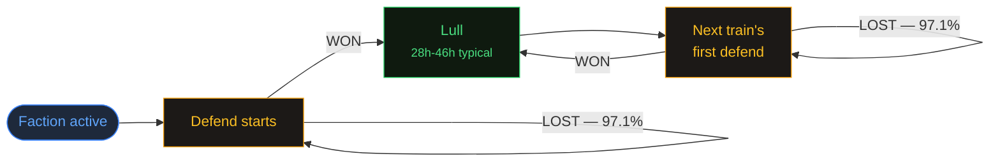

import DefendRegularityChart from './DefendRegularityChartLoader';
import LullByTrainLengthChart from './LullByTrainLengthChartLoader';

export const metadata = {
    title: 'Can We Predict Events? | Helldivers Bot',
    description:
        'Full report on Helldivers 1 event predictability across 160 seasons — attacks fire deterministically the moment a campaign reaches full points and are now forecastable, defends run in trains with a shipped likelihood window.',
    alternates: { canonical: '/docs/predict' },
    openGraph: { url: '/docs/predict' },
};

# Can we predict events?

A report on Helldivers 1 event predictability, built from every recorded event across the game's ~160-season history (6,016 events: 925 attacks, 5,091 defends). Every figure below is reproduced live from the scripts in `scripts/analysis/` — see each section's **In depth** for how to run them yourself.

**Bottom line: no countdown is shipping, and none will — but a likelihood window for defends is live on the dashboard, and attacks have now cleared the bar for one too.**

- **Attacks** are **deterministic**: one fires within minutes of a faction's campaign reaching full points (`points == points_max`). There is no threshold to estimate — it is a constant the game already displays. Forecasting one therefore reduces entirely to forecasting *pace*, which has not been measured yet. An earlier version of this page reported a soft "trigger band" around 90–98%; that was an artifact of coarse sampling and is corrected below.
- **Defends** run in trains with well-established rules, but the one open question — how long the next lull runs — has now been modeled three times, and even the best model (which watches live campaign state and beats every previous attempt) doesn't clear the bar the project set for itself before looking at any numbers. The third attempt did surface one genuinely new, placebo-tested pattern: **when any faction sits at 9 of 10 sectors captured, the galaxy goes quiet** — lulls in that assault window run ~20h longer than usual.

---

## Attacks

Attacks are **deterministic**. An attack on a faction's homeworld fires within minutes of that faction's campaign reaching full points — `points == points_max`, the exact integer. Every one of the 925 recorded attacks targets region 11, the enemy homeworld; none fires early.

There is no threshold to estimate and no distribution to model. The trigger is a constant already stored in `h1_season.points_max`.

### This corrects an earlier version of this page

An earlier version of this report described a **trigger band** — liberation at attack start of p25 0.932 / p50 0.961 / p75 0.983, "89.3% fire at ≥90% liberation", "83.6% fire at exactly 9 of 10 sectors", and the explicit claim that this was *"not 'all ten captured and then it starts.'"*

It is exactly "all ten captured and then it starts." Those figures measured the sensor, not the game.

`h1_status` runs at roughly one bucket per day for 156 of the 160 seasons, so campaign state read at an attack's start could be up to 24 hours stale. A hard threshold viewed through a lagging sensor smears downward into precisely the spread that got published. Sorting the same 925 attacks by how fresh the reading was makes it plain:

| Age of the campaign reading | Attacks | Median liberation at attack start |
| --- | --- | --- |
| &lt;15 min | 13 | **100.00%** |
| &lt;1h | 23 | 99.69% |
| &lt;6h | 170 | 98.87% |
| &lt;12h | 182 | 97.37% |
| &lt;24h | 537 | 94.28% |

The "band" was a staleness gradient. Read fresh, the trigger is a point.

The thirteen freshest readings are more convincing individually than any median, because the residual shortfalls scale with how early the reading was taken:

| Season | Enemy | Reading age | Points / max | Short by | Liberation |
| --- | --- | --- | --- | --- | --- |
| 17 | 2 | 723s | 1,018,465 / 1,020,040 | 1,575 | 99.846% |
| 20 | 0 | **62s** | 763,194 / 763,240 | **46** | **99.994%** |
| 30 | 1 | 421s | 547,798 / 548,210 | 412 | 99.925% |
| 60 | 1 | 482s | 636,241 / 636,530 | 289 | 99.955% |
| 106 | 2 | 781s | 325,657 / 325,740 | 83 | 99.975% |
| 143 | 2 | 361s | 253,842 / 253,910 | 68 | 99.973% |
| 158 | 0 | 841s | 356,240 / 356,240 | **0** | **100.000%** |
| 158 | 1 | 121s | 275,790 / 275,790 | **0** | **100.000%** |
| 158 | 2 | 421s | 147,470 / 147,470 | **0** | **100.000%** |
| 158 | 2 | 541s | 147,470 / 147,470 | **0** | **100.000%** |
| 159 | 0 | 121s | 280,970 / 280,970 | **0** | **100.000%** |
| 159 | 1 | 61s | 325,480 / 325,480 | **0** | **100.000%** |
| 159 | 2 | 182s | 202,300 / 202,300 | **0** | **100.000%** |

Twelve of thirteen sit within 0.1% of full. Season 20's Bug campaign was **46 points short of 763,240 sixty-two seconds before the attack began** — a sensor catching the last seconds of a climb, not a threshold with slack in it. The six sub-100% rows are all pre-S157 seasons whose whole campaign is covered by 13–43 buckets; their shortfall tracks their reading age, exactly as a hard threshold predicts.

### How soon after reaching full points?

For the four seasons with 15-minute resolution, the gap between the first bucket at full points and the attack's start is **1 to 14 minutes, median 3.0** (n = 7). Since a bucket can be up to 15 minutes wide, these are upper bounds. The trigger is effectively immediate.

### Can we forecast the next one?

With the trigger known exactly, forecasting an attack stops being a question about the trigger and becomes a question about **pace**:

```
eta = (points_max − points) / rate
```

Everything on the right-hand side except `rate` is known exactly and in real time. So the entire forecasting problem — and the entire error budget — lives in estimating how fast a campaign is gaining points.

**Measured, and it works.** `09-attack-eta.mjs` backtests that formula walk-forward by season against all 925 attacks, using a 24-hour pace window:

| Faction | Effective N | Skill ratio [95% CI] | Median error vs. baseline | Sharpness vs. marginal |
| --- | --- | --- | --- | --- |
| Bugs | 94 | **0.270** [0.203, 0.356] | 17.3h vs. 64.0h | 69.6h vs. 90.4h — narrower |
| Cyborgs | 96 | **0.233** [0.186, 0.311] | 18.9h vs. 81.3h | 85.5h vs. 94.0h — narrower |
| Illuminate | 125 | **0.325** [0.246, 0.392] | 19.9h vs. 61.3h | 69.9h vs. 88.4h — narrower |

Every confidence interval sits far below the project's 0.6 ship bar, and every configuration passes the sharpness leg. For scale: the best defend model ever built reached 0.679 [0.651, 0.707] and failed. **This is the first thing in this project to clear the gate it was measured against**, and it does so because the trigger is exact — the model is only forecasting pace, not guessing at a threshold.

The forecast is not available at every moment. Roughly **38–47%** of moments emit nothing at all, because a stalled or retreating front (`rate <= 0`) gives no arrival time. A front that is not moving has no ETA, and the honest output is silence.

### What a player would actually see

The intended use is a heads-up, not a countdown, so it is scored as an alert. Both bars were written down before the model was run:

| Faction | Fires before…​ | …​an attack follows within 2× the upper bound | Verdict |
| --- | --- | --- | --- |
| Bugs | 92.6% of attacks | 87.4% of showing moments | PASS |
| Cyborgs | 90.6% | 96.4% | PASS |
| Illuminate | 94.4% | 94.3% | PASS |

Against bars of 70% and 80% respectively. And the window does tighten as the attack approaches — this is the model's own output, on the moments a UI would render:

| When it says | It shows | Width | The attack actually came |
| --- | --- | --- | --- |
| ~2h | 0.8–5.6h | 4.8h | 2.5h |
| ~6h | 4.3–12.6h | 8.3h | 6.0h |
| ~10h | 7.8–19.2h | 11.5h | 9.2h |
| ~14h | 10.7–25.0h | 14.3h | 12.9h |
| ~18h | 13.8–31.4h | 17.7h | 16.0h |
| ~22h | 17.2–38.3h | 21.1h | 20.8h |

A day out the window is ~21 hours wide; a couple of hours out it is ~5. **It never becomes a clock.** The width tracks the estimate itself, so the display goes `17–38h` → `8–19h` → `1–6h` and stops. Curiously the *relative* uncertainty is slightly worse close in — roughly 1× the estimate a day out, 2× a couple of hours out — which is the daily-bucket staleness biting hardest when little remains to conquer.

<details>
<summary>In depth: the anchoring bug, the rate window, and what did not help</summary>

**An anchoring bug, found by the reliability table.** The first run passed every headline number while being badly wrong exactly where it mattered. Restricted to moments a UI would render, the p50 hit rate was 0.650–0.701 against a nominal 0.500 — the model was predicting consistently *later* than reality.

The cause was not the model. `points` is read from the last bucket at or before the evaluation moment, up to 24 hours old, so `remaining / rate` answered *"how long from when the reading was taken"* rather than *"how long from now."* The correction is algebraic — extrapolating the stale reading forward at the same rate is identical to subtracting its age:

```
(max − points − rate × age) / rate  ==  (max − points) / rate − age
```

Median historical reading age is ~12h, so sub-24h forecasts were inflated by roughly their own magnitude, which is why the damage concentrated in the display regime. After the fix:

| p50 hit rate when showing (nominal 0.500) | Before | After |
| --- | --- | --- |
| Bugs | 0.650 | 0.525 |
| Cyborgs | 0.678 | 0.544 |
| Illuminate | 0.701 | 0.568 |

The worst reliability decile moved from 0.701 to 0.460. This is the only defect the gate's calibration leg could not have caught on its own: that leg pools every moment, so a model can pass it while being miscalibrated in every stratum with the errors cancelling. The by-decile reliability table exists because of this, and earned its place on first use.

**The rate window was chosen empirically, without using a single attack.** "Which window best predicts near-future pace" is answerable on all 21,849 high-resolution status rows, which sidesteps the fact that only 8 attacks have ever been recorded at 15-minute resolution. Median error predicting the next six hours of pace:

| Window | 30 min | 1h | 3h | 6h | 12h | **24h** | 48h | 72h |
| --- | --- | --- | --- | --- | --- | --- | --- | --- |
| Error | 42.8% | 34.4% | 28.7% | 28.9% | 29.4% | **23.7%** | 24.5% | 24.5% |

Short windows are far worse, not better — at 15-minute buckets a 30-minute rate is a difference of two readings and mostly noise. Longer than a day is no better either. Blending a short window into the long one helps by 0.6pp at a 20% weight, which does not justify the complexity.

**What did not help.** Both use telemetry already stored in `h1_statistic`, and both made the forecast *worse* than the plain 24-hour rate (23.5%):

| Adjustment | Error |
| --- | --- |
| × (current players / 24h average players) | 28.1% |
| points-per-mission × recent mission rate | 27.0% |

**What did help, and is not yet implemented.** Campaign pace has a strong weekly rhythm — across all 160 seasons, normalising each campaign to its own median pace:

| Sun | Mon | Sat | Tue | Wed | Thu | Fri |
| --- | --- | --- | --- | --- | --- | --- |
| 1.19 | 1.19 | 1.00 | 0.95 | 0.93 | 0.92 | 0.92 |

A 29% swing between the busiest and quietest days. (Sunday and Monday lead because a daily bucket reports the day before it, so weekend play lands there.) Applying an hour-of-week correction cuts the pace error from 23.5% to **18.6%** — but that figure is *in-sample*, learned on the same data it was scored against, so it is an upper bound on the real benefit. A walk-forward implementation is the obvious next piece of work. Public holidays were not tested and are not worth testing: the game's history contains a handful of them.

**Caveats.**

- **Effective N is 94–125 per faction**, not 925. Attacks average 2.17 per faction-season, so most clock moments share a target.
- **The calibration leg flips between factions** (two of three pass, differently before and after the anchoring fix). At this effective N that is noise, not signal, and it should not be read as a result either way.
- **The live model is better fed than the backtested one.** Historical campaign state is up to 24 hours stale; live it is 15 minutes. The same feature measured with less noise makes the backtested error a floor rather than an estimate — but with 8 high-resolution attacks that cannot be demonstrated, only argued.

Reproduce:

```
node --env-file=.env.development scripts/analysis/09-attack-eta.mjs
```

</details>

---

## Defends

A "defend" is an enemy assault you either win or lose. Defends follow five rules, each confirmed against the full 160-season, 5,091-defend history — these aren't statistical tendencies, they're mechanics of the game itself.

1. **Two defends never run at the same time.** Zero overlapping pairs across 47,297 same-faction defend pairs checked.
2. **A faction never defends while you are attacking it.** Zero overlapping pairs across 9,584 same-faction defend/attack pairs checked.
3. **A defend and an attack on *different* factions can overlap.** 955 such pairs found (out of 19,756 different-faction defend/attack pairs checked) — so the constraint in rule 2 is per-faction, not global.
4. **Defends only occur while a faction is active** — never while it's `hidden` (not yet introduced) or `defeated`. *(This is a consequence of how factions work, not a discovered rule.)* 5,019 / 5,091 defends (98.6%) start with recorded status `active`; the remaining 72 (1.4%) read `hidden`, attributable to the campaign snapshot's ~1-bucket/day staleness, not real hidden-state defends. Never `defeated`.
5. **A defend train continues until the players win one.** Lose, and you get hit again almost immediately: **97.1%** of failed defends (3,112 / 3,205) chain into another defend within 10 minutes. Win, and it stops: only **0.1%** of successful defends (1 / 1,437) do the same.

   *A war ending mid-train is the minority case, not a clean second rule.* It's tempting to assume a train only ends when Super Earth is defeated and a new season starts — but the last defend of a season was itself a **failure** in just **49 of 160 seasons (30.6%)**. In the other **69.4%**, the season's final train ended with a win, and the season ended some other way.



Everything inside the train (the self-loops above) is mechanical, not a forecasting target. The only open question is how long the lull runs between one train ending and the next one starting.

### Predicting the next train start

**How good is the best guess we could build?** The most accurate model tested — one that watches live campaign state (see the assault-window finding below) — predicts the wait to within about **8 hours**, typically, on a cycle that runs roughly **44 hours** end to end. A model that ignores everything and always guesses the historical average wait is off by about **12 hours**. So the smart model clearly beats the dumb one — by more with every attempt — but 8 hours of typical error is still close to a fifth of the entire cycle. That's not precise enough for a shrinking countdown bar; it's precise enough to say "usually somewhere between a day and two days," which is a sentence, not a clock.

**The one conditioning fact that matters is visible on the map today:** if any faction has 9 of 10 sectors captured, the current lull is running long — the median wait in that state is ~55h against ~35h otherwise (+20h, placebo-tested, consistent across all four eras of the game's history). The mechanism is coherent with the attack rule above, and sharper than it first looked: 9 of 10 sectors means the faction is *inside its final sector*, with the assault firing the moment that sector completes. `SC9` is therefore the window in which an assault is pending but has not yet fired — and defend trains go quiet through it.

<DefendRegularityChart />

The pooled defend-gap series is dominated by mechanical train continuations (the mass right at zero); restricting to train starts throws those out and leaves a genuinely different, more regular distribution.

<LullByTrainLengthChart />

The previous train's length does **not** predict how long the following lull runs — every stratum sits close to the same ~35–38h median regardless of whether the previous train was a single defend or six-plus.

**Verdict: INCONCLUSIVE.** Not dead — the best model now passes two of the decision gate's three legs (calibration and, for the first time, sharpness) and is a materially better guess than a flat average — but its skill still misses the pre-registered ship bar, so no countdown ships. See **In depth** below for the full skill/calibration numbers and the decision gate they're measured against.

<details>
<summary>In depth: full numbers, method, and what was tested and rejected</summary>

### Event counts

| Metric | Value |
| --- | --- |
| Total defends (160 seasons) | 5,091 |
| Train starts (real forecasting targets) | 1,978 (38.9%) |
| Mechanical follow-ups (not independent targets) | 3,113 (61.1%) |
| Attacks | 925 |

Train length distribution — among the 1,529 trains with both a defined predecessor and a following lull (excludes each season's first train, which has no predecessor, and any train with no successor before the season ends):

| Previous train length | n | Share |
| --- | --- | --- |
| 1 defend | 671 | 43.9% |
| 2 defends | 209 | 13.7% |
| 3 defends | 222 | 14.5% |
| 4 defends | 210 | 13.7% |
| 5 defends | 102 | 6.7% |
| 6+ defends | 115 | 7.5% |

### Regularity: pooled gaps vs. train-start gaps

| Series | n | p25 | median | p75 | IQR |
| --- | --- | --- | --- | --- | --- |
| Pooled defend gaps (any defend → next) | 4,642 | 0.02h | 0.02h | 36.2h | 36.1h |
| Train-start-to-train-start gaps | 1,818 | 33.6h | 44.1h | 56.0h | 22.4h |

The pooled series is genuinely bimodal — half of it sits within minutes of zero (the mechanical chain restarts) and the other half stretches into a long tail. Restricting to train starts throws out the mechanical restarts and leaves a distribution that's both centered higher (the real ~44h cycle) and roughly 40% narrower.

The quantity that actually matters for a "once you hold, the next wave is in..." claim is the **lull** — the gap from when the previous train *ends* to when the next one *starts* (not train-start to train-start, which also includes however long the previous train itself ran):

| Quantity | n | p25 | median | p75 |
| --- | --- | --- | --- | --- |
| Lull (end of previous train → next train start) | 1,818 | 27.8h | 36.8h | 46.4h |

### Does the previous train's length predict the wait?

No. Every stratum's lull sits close to the same ~35-38h median regardless of whether the previous train was a single defend or six-plus:

| Previous train length | n | Lull p25 | Lull median | Lull p75 |
| --- | --- | --- | --- | --- |
| 1 defend | 671 | 23.0h | 34.7h | 47.0h |
| 2 defends | 209 | 29.9h | 38.5h | 46.8h |
| 3 defends | 222 | 29.3h | 37.7h | 45.2h |
| 4 defends | 210 | 28.7h | 37.3h | 45.4h |
| 5 defends | 102 | 28.5h | 33.6h | 43.0h |
| 6+ defends | 115 | 30.7h | 38.4h | 43.2h |

Pearson correlation across the 1,529 trains above: `r = -0.004` for previous-train-length vs. lull, `r = -0.031` for previous-train-failures vs. lull — both well under the `|r| < 0.1` bar the project treats as "no detectable relationship." A separate correlation of previous-train-length against the **start-to-start** gap (not the lull) does show up at `r = 0.176`, but that's mechanical, not predictive: a longer previous train simply pushes its own end time later — and therefore the next start-to-start measurement — even when the lull that follows it is exactly as random as any other lull.

### Prediction accuracy

**Skill ratio**, in one sentence: it's the model's typical error divided by the typical error of always guessing one fixed number (the historical median wait) — 1.0 means the model is no better than that constant guess, and the project's ship bar requires the ratio's entire 95% confidence interval to sit at or under 0.6.

The headline model predicts train-start-to-train-start timing directly (the corrected target, after a labelling bug that pooled real train starts together with mechanical follow-ups was found and fixed):

| Configuration | Calibration | Skill ratio [95% CI] | Median abs. error vs. baseline | Sharpness (predicted band vs. marginal) | Effective N | Verdict |
| --- | --- | --- | --- | --- | --- | --- |
| Train starts, unrestricted moments | FAIL | 0.722 [0.697, 0.748] | 9.7h vs. 13.4h | 23.3h vs. 22.4h — **not narrower** | 1,466 | INCONCLUSIVE |
| **Train starts, no defend active (headline)** | **PASS** | **0.789 [0.766, 0.812]** | **9.1h vs. 11.5h** | 23.1h vs. 22.4h — **not narrower** | 1,463 | **INCONCLUSIVE** |

Calibration on the headline configuration, quartile by quartile (target vs. observed, both within the project's ±0.05 tolerance):

| Quartile | Target | Observed | Within tolerance? |
| --- | --- | --- | --- |
| p25 | 0.250 | 0.208 | Yes (off by 0.042) |
| p50 | 0.500 | 0.485 | Yes (off by 0.015) |
| p75 | 0.750 | 0.764 | Yes (off by 0.014) |

So the model is well-calibrated and clearly beats a flat guess — but it fails the **sharpness** leg of the gate (its predicted 25th–75th percentile band, 23.1h wide, is not narrower than the 22.4h spread of the raw gap distribution it's predicting) and its skill ratio, while below the "not usefully predictable" line of 0.8, sits well above the 0.6 ship bar with a tight confidence interval — this is a clean miss, not an underpowered one.

### Attempt 3: conditioning on live campaign state (2026-07-28)

A third attempt asked whether anything **observable at forecast time** shifts the lull, testing eight pre-declared covariates on the 1,978 train starts with within-season permutation placebos (see the sweep table below). Three survived — all pointing at the homeworld-assault window — and were fed into a state-conditional model: at every walk-forward moment, classify the world as `ATTACK` (an attack is running), `SC9` (some faction has exactly 9 of 10 sectors), `SC10`, or `NORMAL`, then estimate the remaining wait from the 200 nearest training moments *in that state* by elapsed time (with a Kaplan-Meier correction for season-end censoring — the plain version's calibration failure was in exactly the direction its documented censoring bias predicted, and both versions are reported):

| Configuration | Calibration | Skill ratio [95% CI] | Median abs. error | Sharpness vs. 22.4h marginal | Verdict |
| --- | --- | --- | --- | --- | --- |
| Baseline (featureless, from the table above) | PASS | 0.789 [0.766, 0.812] | 9.1h | 23.1h — not narrower | INCONCLUSIVE |
| State-conditional, plain (v1) | FAIL (all rates low) | 0.675 [0.652, 0.698] | 7.8h | 18.9h — **narrower** | INCONCLUSIVE |
| Season-pace adaptive | PASS | 0.825 [0.800, 0.851] | 9.5h | 24.2h — not narrower | NOT USEFULLY PREDICTABLE |
| **State-conditional, KM-corrected (v2)** | **PASS** | **0.679 [0.651, 0.707]** | **7.8h** | **20.4h — narrower** | **INCONCLUSIVE** |

**These defend figures moved slightly in 2026-07-30.** `forwardRecurrenceMedian` was computing the constant baseline over the *unfiltered* season span while the model was scored on filtered moments, so for any `momentFilter` configuration the skill ratio was partly measuring the filter rather than the model. Fixing it raised the filtered skill ratios by roughly 0.03–0.04 (the headline baseline from 0.753 to 0.789, the KM model from 0.648 to 0.679). No verdict changed, and the unrestricted rows are unaffected because they apply no filter. Found while building the attack forecast, which needed the same code path.

The KM configuration is the first model in this project to pass the sharpness leg, and it passes calibration — two of three gate legs, with a skill ratio a clear CI-separated step below every previous attempt. It dies on the leg the gate is strictest about: the skill-ratio CI's upper bound is 0.707 against the ≤ 0.6 ship requirement. Two caveats are disclosed with it: the winning configuration is the post-hoc best of six correlated variants (selection its CI doesn't account for — and it *still* misses), and `h1_status`'s ~daily staleness smears the state boundaries, so the true assault-window effect is likely sharper than measured — a real reason to revisit once enough high-resolution seasons (S157+, 15-minute buckets, only ~49 train starts so far) accumulate.

The season-pace row also settles an untried angle from the handoff: per-season rhythm is real but weak (adjacent-season correlation ~0.35), and an online season-adaptive predictor does **not** beat the featureless baseline.

### What was tested and rejected

#### Trigger hunt — does campaign state predict the event?

Every row compares the variable's spread (interquartile range) at real events against phase-matched controls drawn from the same fractional point in *other* seasons. A **rule-like** result requires both a large effect size (IQR ratio ≤ 0.25) *and* a permutation p-value under the Bonferroni-corrected threshold (α = 0.01 across 5 variables).

| Dataset | Variable | IQR ratio | p-value | Verdict | Why (if rejected) |
| --- | --- | --- | --- | --- | --- |
| Defends (all 5,091) | liberation | 1.087 | 1.0000 | No rule | — |
| Defends (all 5,091) | sectorsCaptured | 1.000 | 1.0000 | No rule | — |
| Defends (all 5,091) | daysIntoSeason | 1.538 | 1.0000 | No rule | — |
| Defends (all 5,091) | hoursSincePrevEventEnd | 0.354 | 0.0005 | No rule | Significant p-value, but effect size (0.354) sits above the 0.25 rule-like bar — real but too weak/diffuse to call a threshold |
| Defends (all 5,091) | playerPercentile | 1.180 | 1.0000 | No rule | — |
| Attacks (925) | liberation | **0.135** | **0.0005** | **RULE-LIKE** | Kept — see § Attacks |
| Attacks (925) | sectorsCaptured | **0.000** | **0.0005** | **RULE-LIKE** | Kept — see § Attacks |
| Attacks (925) | daysIntoSeason | 0.912 | 0.0515 | No rule | This is the control check — flat, confirming the liberation/sector signal is campaign state, not a season-calendar artifact |
| Attacks (925) | hoursSincePrevEventEnd | 0.847 | 0.0105 | No rule | Barely misses the corrected α (0.01) |
| Attacks (925) | playerPercentile | 1.004 | 0.6592 | No rule | — |
| Train starts (1,978) | liberation | 1.053 | 0.9810 | No rule | Confirms dilution hypothesis rejected — restricting to train starts didn't unmask a hidden trigger |
| Train starts (1,978) | sectorsCaptured | 1.000 | 1.0000 | No rule | — |
| Train starts (1,978) | daysIntoSeason | 1.416 | 1.0000 | No rule | — |
| Train starts (1,978) | hoursSincePrevEventEnd | 0.959 | 0.1634 | No rule | Also a definitional shift, not just dilution — see note below |
| Train starts (1,978) | playerPercentile | 1.166 | 1.0000 | No rule | — |

*Note on `hoursSincePrevEventEnd`:* this variable changes meaning between the pooled and train-starts rows above — the pooled column means "hours since the previous defend of any kind ended," while the train-starts column means "hours since the previous **train's** first defend ended" (mechanical follow-ups are excluded from that lookup entirely). The jump from 0.354 to 0.959 is therefore partly a definitional change, not purely evidence that dilution was masking a signal — the four campaign-state variables above (which don't have this ambiguity) land at "no rule" either way, which is the load-bearing comparison.

#### Covariate sweep — previously untested variables

Seven additional variables tested against defend **train starts** specifically, Bonferroni-corrected across 7 (α = 0.00714). Four cleared the Bonferroni threshold on raw p-value; **all four were subsequently rejected** — two (`libVelocity1d`, `libVelocity3d`) via same-season placebo tests a reviewer re-ran by hand, the other two on adversarial review of the raw effect. This sweep was not re-run for this page (its findings are unaffected by the small growth in defend count since):

| Variable | Type | Effect | p-value | Verdict | Why rejected |
| --- | --- | --- | --- | --- | --- |
| libVelocity1d (liberation gained/day) | continuous | IQR ratio 0.832 | 0.0005 | Rejected | Control-design artifact, not a trigger. Against cross-season controls it clears the bar comfortably; swapping to same-season controls (only the control draw changed) drops it to **0.998, p = 0.4838** — a coin flip. Two more same-season variants agree it's an artifact (random legal moments: 0.965, p=0.1139; non-overlapping shifts: 1.246, p=1.0000). |
| libVelocity3d | continuous | IQR ratio 0.806 | 0.0005 | Rejected | Unstable, not merely small. Survives the same-season "otherwise identical" placebo (0.804, p=0.0005) but dies under same-season random legal moments (0.890, p=0.0650) and same-season non-overlapping shifts (1.114, p=0.9920 — events *wider* than controls). Direction is also incoherent with 1d: the event-side median is *lower* than controls at 1d, *higher* at 3d. |
| libVelocity7d | continuous | IQR ratio 1.053 | 0.8501 | No rule | — |
| pointsTakenRatio | continuous | IQR ratio 1.288 | 1.0000 | No rule | — |
| playersRelToSeasonMedian | continuous | IQR ratio 1.603 | 1.0000 | No rule | — |
| factionStatusActive | binary | +13.4pp at events (97.8% vs 84.4%) | 0.0005 | Rejected | Restates the definitional "must be active" rule (§ Defends, rule 4), not a fresh trigger |
| otherFactionEventActive | binary | −34.0pp at events (9.3% vs 43.3%) | 0.0005 | Rejected | The largest raw effect in the sweep, but rejected on adversarial review along with the other three |

An earlier feature-engineering pass (`03-hazard.mjs`, not re-run for this page — its target, all pooled defend gaps, has since been superseded by the train-start correction) added cyclic hour-of-day, a weekend indicator, and capped elapsed-hours to a logistic hazard model. Every variant came out **worse** than the plain baseline (skill ratios 1.057–1.464, all above 1.0), and a reviewer independently re-implemented the fitter from scratch to confirm it wasn't a convergence bug. Full numbers in the [findings doc](https://github.com/elfensky/helldivers.bot/blob/main/docs/superpowers/findings/2026-07-27-next-event-timing.md#phase-3--features-made-it-worse-verified).

#### Second covariate sweep — train-start lulls, same-season placebos built in

The 2026-07-28 sweep (`06-train-covariates.mjs`) tested eight pre-declared covariates against the lull, every one under a **within-season** label permutation (an effect has to exist inside individual seasons to register — cross-season composition can't manufacture it) *and* a phase-stratified variant (permuting only within season × season-phase third — within-season calendar drift can't either). Bonferroni α = 0.00625, 2,000 seeded permutations:

| # | Covariate | Observable during the lull? | Within-season effect | p (plain / phase-stratified) | Verdict |
| --- | --- | --- | --- | --- | --- |
| 1 | Hour-of-day of train starts | — | χ² 32.2 (df 23), rate ratios 0.79–1.31 | 0.13 (season-rotation null) | Null — the pooled χ²=128.1 was follow-up dilution |
| 2 | Day-of-week of train starts | — | χ² 3.5 (df 6) | 0.57 | Null — no weekend effect on train starts |
| 3 | Previous train's faction | Yes | −0.7h | 0.74 / 0.94 | Null |
| 4 | Previous train's region = 9 | Yes | −0.3h | 1.00 / 1.00 | Null |
| 5 | Previous train's region = 10 | Yes | **+10.1h** | **0.0005 / 0.0005** | Real — a proxy for the assault window |
| 6 | *Next* train's region = 9 | **No** (revealed at the event) | +11.5h | 0.0005 / 0.0005 | Real structure, unusable as a feature |
| 7 | **Max sectors captured = 9** | **Yes** | **+20.3h** | **0.0005 / 0.0005** | **The assault window — the headline finding** |
| 8 | Attack active | Yes | −11.5h | 0.0005 / 0.0005 | Real (at moment level the state predicts *longer* remaining waits — it persists through long lulls) |
| — | Confound check: SC9 vs SC10 | — | +20.3h | 0.0005 | SC10 is *later* in the season yet reverts to baseline — a monotone season-phase confound cannot produce this reversal. The deterministic trigger explains why: at SC10 the assault has already fired, so the pending-assault window has closed |

Two supporting facts tie the significant rows into one mechanism: train-start region is largely a campaign-state readout (73% of train starts fire within ±1 sector of the faction's frontier), and attacks fire the instant the 10th sector completes — so rows 5, 6, and 7 are all views of the same pre-assault window. There is also **no hard cooldown floor** (minimum lull 0.09h; smooth left tail in every era) — the soft p05 drift across eras (12h → 25h) is non-stationarity, not a mechanic.

### Why so many "we found it!" results didn't survive

The most notable false lead was `libVelocity1d` (how fast a faction had been losing ground right before a defend), which looked significant at first glance. Here's the trap the project's own control design fell into, and how it was caught.

Imagine testing whether people eat bigger dinners right before a thunderstorm. If you compare pre-storm dinners in Seattle against random, ordinary dinners in Cairo, you'll almost certainly find a difference — Seattle and Cairo just eat differently, storm or no storm. The fix is to compare like with like: pre-storm dinners in Seattle against ordinary dinners *also in Seattle*.

This project's trigger-hunt controls are built the *first* way, not the second: every comparison draws its control points from the *same fractional position in other seasons' wars* — a different war, at the same "how far into the war are we" moment. That's the Cairo mistake wearing a lab coat — different wars run at different speeds, so a war-to-war difference can look like a defend-related one. That's exactly what happened with `libVelocity1d`: against cross-season controls it clears the statistical significance bar comfortably (IQR ratio 0.832, permutation p = 0.0005 for the 1-day window). What actually caught it was a reviewer re-running the identical test with exactly one thing changed — controls drawn from the event's *own* season instead of another one — at which point the effect evaporated (IQR ratio 0.998, p = 0.4838; a one-in-two-thousand result became a coin flip). That same-season check wasn't in the committed scripts at the time — a reviewer ran it by hand. The honest lesson is that the check belongs in the code, and as of the 2026-07-28 sweep it is: `06-train-covariates.mjs` runs every test against within-season permutation controls, so a Cairo-style artifact can no longer clear that sweep's bar.

### Method & caveats

- **Walk-forward by season.** Every backtest steps a clock through held-out seasons in sequence — never trained on a season's own future.
- **Controls are phase-matched, not season-matched.** Every control point is drawn from the same fractional position through a *different* season's war, which guards against season-calendar drift. But this design has its own complementary risk — different wars simply run at different speeds, so a cross-season difference can be about the *wars*, not the mechanic — and the `libVelocity1d`/`libVelocity3d` placebo tests above confirm that risk is real, not theoretical. Read every cross-season trigger-hunt result in this report as provisional until the gap below is closed.
- **The same-season placebo is now in the pipeline — for the current sweep.** The check that falsified `libVelocity1d` was originally run by hand by a reviewer; as of 2026-07-28, `06-train-covariates.mjs` builds every one of its tests on within-season permutation (plus a phase-stratified variant), so the second sweep's findings carry their placebo in the committed code. The remaining gap is historical: `01-trigger-hunt.mjs` and `05-defend-covariates.mjs` still implement cross-season controls only, so *their* published results remain provisional in the sense described above.
- **Permutation tests, Bonferroni-corrected.** 2,000 permutations per test; α is divided by the number of variables tested in that sweep (5 for the trigger hunt, 7 for the covariate sweep).
- **The decision gate was written down before any numbers existed.** Shipping a countdown required *all three*: calibration within ±0.05 of nominal at every quartile, a skill-ratio 95% CI entirely at or under 0.6, and a predicted band narrower than the unconditional gap/lull spread. Missing any one leg is enough to fail.
- **Campaign-state resolution is coarse, and it has already fooled this report once.** `h1_status` updates roughly once a day for 156 of the 160 seasons — only the 4 most recent seasons have 15-minute resolution, so campaign state measured at an event's start can be up to 24 hours stale. Coarse sampling cannot manufacture a signal from noise, but it *can* convert a hard rule into a plausible-looking distribution: the attack "trigger band" published in an earlier version of this page was exactly that (see § Attacks). Read every campaign-state figure here as smeared by up to a day, and treat any tidy-looking spread as a candidate artifact until it has been checked against the S157+ high-resolution seasons.
- **Effective N is far below the raw moment count.** The walk-forward backtest steps a clock in hourly-to-3-hourly increments, producing many near-duplicate, autocorrelated observations inside a single wait. Every confidence interval above is a season-level block-bootstrap (resampling whole seasons, not individual clock-ticks).
- **Some earlier tests were deleted, not patched, after being found degenerate.** A previous-train-length "concentration" test was found to be invariant to the data — shuffling the input reproduced identical output, and a synthetic world with a deliberately deterministic trigger still scored "no signal." A statistic that can't tell shuffled data from real data isn't evidence either way, so it was removed and replaced with the direct lull-correlation test above, not adjusted.
- **A labelling bug was found and fixed mid-project.** Train continuation was originally chained by season + timestamp only, without scoping to a single faction — a cross-faction pair sitting next to each other in that ordering could be mislabelled as one train continuing. Fixing this (scoping to season **and** faction) moved train-start counts from 1,976 to 1,977 and shifted the previous-train-length correlation sample from 1,816 to 1,528 pairs against the dataset as it stood at the time; every number in this report reflects the corrected labelling against the current, slightly larger dataset.

**Reproduce everything above:**

```
node --env-file=.env.development scripts/analysis/01-trigger-hunt.mjs
node --env-file=.env.development scripts/analysis/02-baseline.mjs
node --env-file=.env.development scripts/analysis/04-train-baseline.mjs
node --env-file=.env.development scripts/analysis/05-defend-covariates.mjs
node --env-file=.env.development scripts/analysis/06-train-covariates.mjs
node --env-file=.env.development scripts/analysis/08-attack-trigger.mjs
node --env-file=.env.development scripts/analysis/09-attack-eta.mjs
node --env-file=.env.development scripts/analysis/07-train-state-model.mjs
```

Full narrative write-up: [`docs/superpowers/findings/2026-07-27-next-event-timing.md`](https://github.com/elfensky/helldivers.bot/blob/main/docs/superpowers/findings/2026-07-27-next-event-timing.md). Script-by-script reference: [`scripts/README.md`](https://github.com/elfensky/helldivers.bot/blob/main/scripts/README.md#analysis).

### Cross-references

- See [Architecture](/docs/architecture) for how `h1_status`, `h1_event`, and `h1_event_progress` are populated — the tables every script in this report reads from.
- See [Data Flow](/docs/data-flow) for the bucket-upsert pattern behind `h1_status`'s ~15-minute-or-1-day resolution, referenced in the caveats above.

</details>
