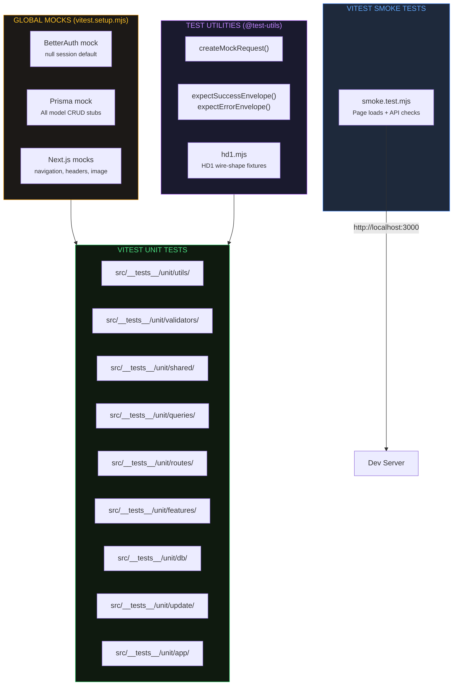

export const metadata = {
    title: 'Testing | Helldivers Bot',
    description:
        'Vitest unit tests, smoke tests, and testing conventions for helldivers.bot.',
    alternates: { canonical: '/docs/testing' },
    openGraph: { url: '/docs/testing' },
};

# Testing

Technical reference for the helldivers.bot testing infrastructure. Audience: project owner and AI assistants.

---

## Overview

The project uses **Vitest** for all tests, with two separate configs:

- **Unit tests** (`vitest.config.mjs`) — utilities, validators, API route handlers, queries, features, and shared modules
- **Smoke tests** (`vitest.smoke.config.mjs`) — HTTP-level checks against a running dev server

Tests live in `src/__tests__/` following conventions from the euraika/aegis projects.



---

## Directory Structure

```
src/__tests__/
├── unit/                    # Vitest unit tests
│   ├── app/                 # Tests for App Router routes (e.g. api/h1/live)
│   ├── db/                  # Tests for src/db/* helpers
│   ├── features/            # Tests for src/features/* (archives, galaxy, stats, timeline, admin)
│   ├── queries/             # Tests for src/db/queries/*
│   ├── routes/              # Tests for API route handlers
│   ├── shared/              # Tests for src/shared/* (enums, hooks, utils)
│   ├── update/              # Tests for update pipeline (season, status, fetch, push)
│   ├── utils/               # Tests for src/utils/* (admin, format)
│   └── validators/          # Tests for src/validators/*
├── smoke/                   # Vitest smoke tests (against running dev server)
│   └── smoke.test.mjs       # Page loads + API endpoint checks
├── visual/                  # Vitest browser-mode screenshot tests
│   ├── *.visual.test.jsx    # One file per component under test
│   ├── fixtures.mjs         # Literal fixture data (frozen clock, map state, stat rows)
│   ├── renderVisual.jsx     # Mount helper: live-data provider + screenshot wrapper
│   ├── stubs/               # next/image, next/link, @sentry/nextjs stand-ins
│   └── __screenshots__/     # Committed baseline PNGs
└── utils/                   # Shared test utilities
    └── index.mjs            # Mock factories and helpers
```

Root-level config files:

| File                      | Purpose                                          |
| ------------------------- | ------------------------------------------------ |
| `vitest.config.mjs`       | Vitest unit test config (env, aliases, coverage) |
| `vitest.setup.mjs`        | Global mocks (auth, Prisma, Next.js modules)     |
| `vitest.smoke.config.mjs` | Vitest smoke test config (30s timeout, node env) |
| `vitest.visual.config.mjs` | Visual regression config (chromium browser mode)  |

---

## NPM Scripts

| Script                  | Description                                  |
| ----------------------- | -------------------------------------------- |
| `npm test`              | Run unit tests then smoke tests sequentially |
| `npm run test:unit`     | Vitest single run (unit tests only)          |
| `npm run test:coverage` | Vitest with v8 coverage report               |
| `npm run test:e2e`      | Smoke tests via vitest.smoke.config.mjs      |
| `npm run test:visual`   | Visual regression tests (requires Docker)    |
| `npm run test:visual:update` | Rewrite the visual baselines            |

**Note:** Smoke tests require a running dev server at `http://localhost:3000`. Never start the dev server from Claude — ask the user.

---

## Vitest Configuration

**Environment:** `node` (default). Component tests opt in to `jsdom` via per-file comment:

```js
// @vitest-environment jsdom
```

**Globals:** `true` — `describe`, `test`, `expect`, `vi` are available without import.

**Path aliases:**

- `@` → `./src` (matches `jsconfig.json`)
- `@test-utils` → `./src/__tests__/utils`

**Coverage:**

- Provider: v8
- Reporters: text, html
- Excludes: `src/generated/**`, test files, `src/__tests__/**`, malformed enum files

No global thresholds are set yet — add them once meaningful coverage exists.

---

## Global Mocks (vitest.setup.mjs)

The setup file runs before each test file and provides mocks for:

### BetterAuth

```js
// Default: logged out (null session)
// Override in tests:
import { auth } from '@/auth';
vi.mocked(auth.api.getSession).mockResolvedValue({ user: { id: 'u1', role: 'admin' } });
```

### Prisma Client

All models from the schema are mocked with stub CRUD methods (`findMany`, `findUnique`, `create`, `update`, `delete`, etc.). The mock targets `@/db/db` (the singleton export).

```js
import db from '@/db/db';
vi.mocked(db.h1_season.findMany).mockResolvedValue([{ id: 1, season: 1 }]);
```

This global mock is the **single** db-mocking convention. Do not add a local
`vi.mock('@/db/db')` in a test file — a local factory shadows the global with a
strict subset, so any model or method the file later needs silently becomes
`undefined`. If a model is missing, add it to `vitest.setup.mjs` instead.

### Observability

`reportError` is mocked globally so Sentry never fires from a test, and so tests
don't have to re-implement `tryCatch` just to suppress its error side-effect.
The one file that tests the real implementation opts out explicitly:

```js
vi.unmock('@/shared/utils/observability.mjs');
const { reportError } = await vi.importActual('@/shared/utils/observability.mjs');
```

### Next.js Modules

- `next/navigation` — `useRouter`, `usePathname`, `useSearchParams`, `redirect`, `notFound`
- `next/headers` — `headers`, `cookies`
- `next/image` — passthrough (no optimization)
- `next/link` — passthrough

All mocks are cleared via `vi.clearAllMocks()` in `beforeEach`.

---

## Test Utilities

Location: `src/__tests__/utils/index.mjs` (importable as `@test-utils`)

### createMockRequest(url, method, body, headers)

Wraps `new Request()` for API route handler tests. Sets `content-type: application/json` by default.

### expectSuccessEnvelope(body, opts) / expectErrorEnvelope(body, opts)

Assert that an API response body matches the standard envelope produced by
`src/shared/utils/api/responses.mjs`.

### HD1 wire fixtures (`@test-utils/hd1.mjs`)

Factories for the official HD1 API wire shapes. Event factories are **scoped to
the endpoint whose schema they satisfy** — `makeStatusDefendEvent`,
`makeStatusAttackEvent`, `makeSeasonDefendEvent`, `makeSeasonAttackEvent` — because
`get_campaign_status` and `get_snapshots` declare genuinely different (and in
places opposite) field sets. A single superset factory would satisfy all four
schemas today while hiding field-set contract changes from the rejection tests,
since Zod strips unknown keys. Keep the field sets exact.

Also exports the shapes that genuinely do unify: `makeValidStatus`,
`makeValidSeason`, `makeSnapshot`, `makeSnapshotFrame`, `makeCampaignStatus`,
`makeStatistics`, and the `h1_season` DB row `makeSeasonRow`.

All factories return plain, mutable objects so callers can build rejection cases
via rest-destructure or `delete obj.field`.

---

## Test Naming Conventions

| Type         | Pattern      | Location               |
| ------------ | ------------ | ---------------------- |
| Unit test    | `*.test.mjs` | `src/__tests__/unit/`  |
| Smoke test   | `*.test.mjs` | `src/__tests__/smoke/` |
| Test utility | `*.mjs`      | `src/__tests__/utils/` |

---

## API Route Testing Pattern

App Router route handlers are tested by importing the handler directly:

```js
// No local vi.mock('@/db/db') — vitest.setup.mjs already provides it.
import db from '@/db/db';
import { GET } from '@/app/api/healthcheck/route';

test('returns 200 when database is reachable', async () => {
    db.$queryRaw.mockResolvedValue([{ '?column?': 1 }]);
    const res = await GET(new Request('http://localhost/api/healthcheck'));
    expect(res.status).toBe(200);
});
```

For routes that depend on Prisma or auth, mock those modules first — the global mocks in `vitest.setup.mjs` handle the defaults.

---

## Smoke Test Configuration

Smoke tests use a separate Vitest config (`vitest.smoke.config.mjs`) — not Playwright.

- **Test directory:** `src/__tests__/smoke/`
- **Config:** `vitest.smoke.config.mjs`
- **Timeout:** 30 seconds per test (network requests to running dev server)
- **Base URL:** `http://localhost:3000`

---

## Visual Regression Tests

Screenshot tests that catch layout and styling regressions unit tests cannot see. They run in Vitest's browser mode (chromium via Playwright) and mount real client components with fixture data — no Next server, no database, no third-party service.

`DashboardClient` reads everything from `LiveDataContext`, so wrapping it in a provider with a static payload renders the whole dashboard from one fixture. Current baselines: dashboard (desktop + mobile), `EventCard` (attack + defend), `StatGrid`.

**Docker is required.** Baseline PNGs are platform-specific — font rendering and antialiasing differ between macOS and Linux — so both generation and comparison run inside `mcr.microsoft.com/playwright:v1.62.1-noble` via `scripts/visual-tests.sh`. A baseline generated anywhere else fails on noise instead of on regressions.

```bash
npm run test:visual          # compare against committed baselines
npm run test:visual:update   # accept current rendering as the new baselines
```

Determinism comes from four things, all in `src/__tests__/visual/setup.mjs` and the config: a frozen `Date` (`vi.useFakeTimers({ toFake: ['Date'] })`, so `setTimeout`/rAF still work), a global rule zeroing every animation and transition, explicit `page.viewport()` per test, and literal fixtures. Aliased stubs replace `next/image`, `next/link`, and `@sentry/nextjs`, none of which work outside a Next runtime.

When a baseline changes, review the diff PNG under `.vitest-attachments/` before accepting it. Visual tests are not part of `npm run test:unit`.

**In CI:** the `Visual Regression` job in `.github/workflows/ci.yml` runs on every PR and push to `main`/`develop`, inside the same Playwright image (as a job `container:`, so it calls `vitest` directly rather than the Docker script). On failure it uploads the actual/diff PNGs as a `visual-diffs` artifact. The image tag appears in three places — the CI job, `scripts/visual-tests.sh`, and the `playwright` devDependency — and all three must move together, or CI and local runs stop agreeing on what a pixel looks like.

---

## Gitignore

Test artifacts are excluded from version control:

```
/coverage            # Vitest coverage reports
/test-results/       # Legacy Playwright output
/playwright-report/  # Playwright HTML report
/playwright/         # Playwright screenshots & artifacts
.playwright-mcp/     # Playwright MCP state
.vitest-attachments/ # Visual regression actual/diff PNGs
```

Visual baselines under `src/__tests__/visual/__screenshots__/` **are** committed — they are the reference the tests compare against.
