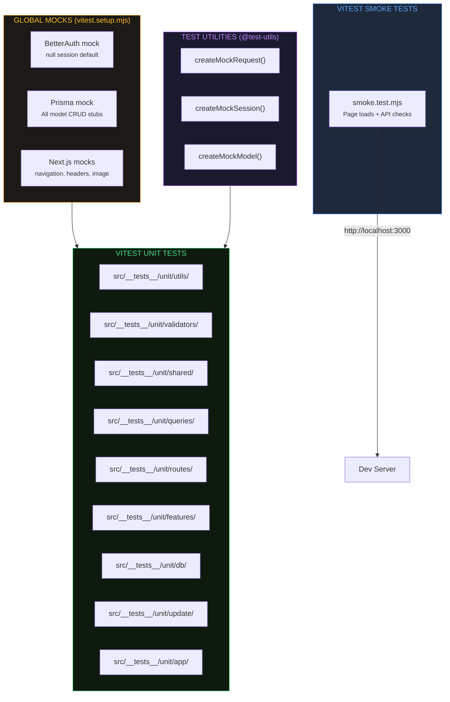

export const metadata = {
    title: 'Testing | Helldivers Bot',
    description:
        'Vitest unit tests, smoke tests, and testing conventions for helldivers.bot.',
    alternates: { canonical: '/docs/testing' },
    openGraph: { url: '/docs/testing' },
};

# Testing

Technical reference for the helldivers.bot testing infrastructure. Audience: project owner and AI assistants.

---

## Overview

The project uses **Vitest** for all tests, with two separate configs:

- **Unit tests** (`vitest.config.mjs`) — utilities, validators, API route handlers, queries, features, and shared modules
- **Smoke tests** (`vitest.smoke.config.mjs`) — HTTP-level checks against a running dev server

Tests live in `src/__tests__/` following conventions from the euraika/aegis projects.



---

## Directory Structure

```
src/__tests__/
├── unit/                    # Vitest unit tests
│   ├── app/                 # Tests for App Router routes (e.g. api/h1/live)
│   ├── db/                  # Tests for src/db/* helpers
│   ├── features/            # Tests for src/features/* (archives, galaxy, stats, timeline, admin)
│   ├── queries/             # Tests for src/db/queries/*
│   ├── routes/              # Tests for API route handlers
│   ├── shared/              # Tests for src/shared/* (enums, hooks, utils)
│   ├── update/              # Tests for update pipeline (season, status, fetch, push)
│   ├── utils/               # Tests for src/utils/* (admin, format)
│   └── validators/          # Tests for src/validators/*
├── smoke/                   # Vitest smoke tests (against running dev server)
│   └── smoke.test.mjs       # Page loads + API endpoint checks
└── utils/                   # Shared test utilities
    └── index.mjs            # Mock factories and helpers
```

Root-level config files:

| File                      | Purpose                                          |
| ------------------------- | ------------------------------------------------ |
| `vitest.config.mjs`       | Vitest unit test config (env, aliases, coverage) |
| `vitest.setup.mjs`        | Global mocks (auth, Prisma, Next.js modules)     |
| `vitest.smoke.config.mjs` | Vitest smoke test config (30s timeout, node env) |

---

## NPM Scripts

| Script                  | Description                                  |
| ----------------------- | -------------------------------------------- |
| `npm test`              | Run unit tests then smoke tests sequentially |
| `npm run test:unit`     | Vitest single run (unit tests only)          |
| `npm run test:coverage` | Vitest with v8 coverage report               |
| `npm run test:e2e`      | Smoke tests via vitest.smoke.config.mjs      |

**Note:** Smoke tests require a running dev server at `http://localhost:3000`. Never start the dev server from Claude — ask the user.

---

## Vitest Configuration

**Environment:** `node` (default). Component tests opt in to `jsdom` via per-file comment:

```js
// @vitest-environment jsdom
```

**Globals:** `true` — `describe`, `test`, `expect`, `vi` are available without import.

**Path aliases:**

- `@` → `./src` (matches `jsconfig.json`)
- `@test-utils` → `./src/__tests__/utils`

**Coverage:**

- Provider: v8
- Reporters: text, html
- Excludes: `src/generated/**`, test files, `src/__tests__/**`, malformed enum files

No global thresholds are set yet — add them once meaningful coverage exists.

---

## Global Mocks (vitest.setup.mjs)

The setup file runs before each test file and provides mocks for:

### BetterAuth

```js
// Default: logged out (null session)
// Override in tests:
import { auth } from '@/auth';
vi.mocked(auth.api.getSession).mockResolvedValue(createMockSession());
```

### Prisma Client

All models from the schema are mocked with stub CRUD methods (`findMany`, `findUnique`, `create`, `update`, `delete`, etc.). The mock targets `@/db/db` (the singleton export).

```js
import db from '@/db/db';
vi.mocked(db.h1_season.findMany).mockResolvedValue([{ id: 1, season: 1 }]);
```

### Next.js Modules

- `next/navigation` — `useRouter`, `usePathname`, `useSearchParams`, `redirect`, `notFound`
- `next/headers` — `headers`, `cookies`
- `next/image` — passthrough (no optimization)
- `next/link` — passthrough

All mocks are cleared via `vi.clearAllMocks()` in `beforeEach`.

---

## Test Utilities

Location: `src/__tests__/utils/index.mjs` (importable as `@test-utils`)

### createMockRequest(url, method, body, headers)

Wraps `new Request()` for API route handler tests. Sets `content-type: application/json` by default.

### createMockSession(overrides)

Returns a BetterAuth session object with `user` and `session` sub-objects (test user, 24h expiry). Merge overrides for custom scenarios.

### createMockModel()

Returns a Prisma model stub with all standard CRUD methods as `vi.fn()`. Useful for ad-hoc mocks beyond what `vitest.setup.mjs` provides.

---

## Test Naming Conventions

| Type         | Pattern      | Location               |
| ------------ | ------------ | ---------------------- |
| Unit test    | `*.test.mjs` | `src/__tests__/unit/`  |
| Smoke test   | `*.test.mjs` | `src/__tests__/smoke/` |
| Test utility | `*.mjs`      | `src/__tests__/utils/` |

---

## API Route Testing Pattern

App Router route handlers are tested by importing the handler directly:

```js
vi.mock('@/db/db', () => ({ default: { $queryRaw: vi.fn() } }));
import db from '@/db/db';
import { GET } from '@/app/api/healthcheck/route';

test('returns 200 when database is reachable', async () => {
    db.$queryRaw.mockResolvedValue([{ '?column?': 1 }]);
    const res = await GET(new Request('http://localhost/api/healthcheck'));
    expect(res.status).toBe(200);
});
```

For routes that depend on Prisma or auth, mock those modules first — the global mocks in `vitest.setup.mjs` handle the defaults.

---

## Smoke Test Configuration

Smoke tests use a separate Vitest config (`vitest.smoke.config.mjs`) — not Playwright.

- **Test directory:** `src/__tests__/smoke/`
- **Config:** `vitest.smoke.config.mjs`
- **Timeout:** 30 seconds per test (network requests to running dev server)
- **Base URL:** `http://localhost:3000`

---

## Gitignore

Test artifacts are excluded from version control:

```
/coverage            # Vitest coverage reports
/test-results/       # Legacy Playwright output
/playwright-report/  # Playwright HTML report
/playwright/         # Playwright screenshots & artifacts
.playwright-mcp/     # Playwright MCP state
```
