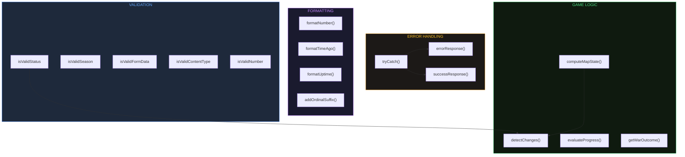

export const metadata = {
    title: 'Utilities | Helldivers Bot',
    description:
        'Shared utilities, Zod validators, formatting helpers, and analytics architecture for helldivers.bot.',
    alternates: { canonical: '/docs/utilities' },
    openGraph: { url: '/docs/utilities' },
};

# Utilities Reference

Lookup reference for all shared utility functions and validation schemas — signatures, behavior, edge cases, and source locations.



---

## 1. Error Handling — `tryCatch`

`src/shared/utils/tryCatch.mjs`

```js
export async function tryCatch(promise) {
    try {
        const data = await promise;
        return { data, error: null };
    } catch (error) {
        return { data: null, error };
    }
}
```

### Behavior

Wraps any `Promise` and returns a two-field result object instead of throwing. This is the project-wide substitute for `try/catch` blocks; every async operation in the codebase goes through this wrapper.

| Field   | On success     | On failure            |
| ------- | -------------- | --------------------- |
| `data`  | Resolved value | `null`                |
| `error` | `null`         | Caught `Error` object |

### Usage pattern

```js
const { data, error } = await tryCatch(someAsyncOp());
if (error) {
    // handle error
}
// use data
```

### Called from

`src/update/status.mjs`, `src/update/season.mjs`, `src/instrumentation.js`, API route handlers, page-level server components.

---

## 2. Response Helpers

`src/shared/utils/api/responses.mjs`

Both helpers return a `NextResponse.json()` with a consistent envelope shape and include elapsed time via `performanceTime(start)`.

### `errorResponse(code, start, error?)`

```ts
errorResponse(code: number, start: number, error?: any): NextResponse
```

**Behavior:**

- Throws `Error('Invalid error code')` if `code` starts with `'1'`, `'2'`, or `'3'` — callers must pass a 4xx or 5xx code.
- Returns `NextResponse.json({ time, code, message, error }, { status: code })`.
- `error` parameter defaults to `null` when omitted.
- Unknown codes fall through to the `default` branch: message becomes `'Unknown error'` and HTTP status is overridden to `500`.

**Response envelope:**

```json
{
    "time": "<number>",
    "code": "<number>",
    "message": "<string>",
    "error": "<any | null>"
}
```

**Supported codes:**

| Code      | Message                                   |
| --------- | ----------------------------------------- |
| 400       | Bad Request                               |
| 401       | Unauthorized                              |
| 403       | Forbidden                                 |
| 404       | Not found                                 |
| 405       | Method not allowed                        |
| 418       | I'm a teapot                              |
| 429       | Too many requests                         |
| 451       | Unavailable for legal reasons             |
| 500       | Internal server error                     |
| 501       | Not implemented                           |
| 502       | Bad gateway                               |
| 503       | Service unavailable                       |
| _(other)_ | Unknown error — HTTP status forced to 500 |

> **Note:** Code 401 means "I don't know who you are." Code 403 means "I know who you are but you're still not allowed." Code 502 is used specifically when the upstream official Helldivers API is unreachable.

---

### `successResponse(code, start, data)`

```ts
successResponse(code: number, start: number, data: any): NextResponse
```

**Behavior:**

- Throws `Error('Invalid success code')` if `code` does not start with `'2'`.
- Returns `NextResponse.json({ time, code, message, data }, { status: code })`.
- Unknown 2xx codes fall through to the `default` branch: message becomes `'Unknown'` and HTTP status is overridden to `200`.

**Response envelope:**

```json
{
    "time": "<number>",
    "code": "<number>",
    "message": "<string>",
    "data": "<any>"
}
```

**Supported codes:**

| Code          | Message                             |
| ------------- | ----------------------------------- |
| 200           | OK                                  |
| 201           | Created                             |
| 202           | Accepted                            |
| 203           | Non-authoritative information       |
| 204           | No content                          |
| _(other 2xx)_ | Unknown — HTTP status forced to 200 |

---

## 3. Time Utilities

`src/shared/utils/time.mjs`

### Performance measurement (server-side)

| Function                 | Signature                  | Returns    | Description                                                                                                                                                                                                                                    |
| ------------------------ | -------------------------- | ---------- | ---------------------------------------------------------------------------------------------------------------------------------------------------------------------------------------------------------------------------------------------- |
| `performanceTime`        | `(start: number) → number` | Elapsed ms | `performance.now() - start`. Used directly inside `responses.mjs` for the `time` field on every API response.                                                                                                                                  |
| `roundedPerformanceTime` | `(start: number) → number` | Rounded ms | Rounds elapsed time up to the nearest 50ms using `Math.ceil(elapsed / 50) * 50`. Examples: 33ms → 50, 60ms → 100, 111ms → 150. Purpose: coarse bucketing for Umami analytics events so individual requests don't create unbounded cardinality. |

### Relative and formatted time (UI helpers)

| Function     | Signature               | Returns                      | Description                                                                                                                                                                               |
| ------------ | ----------------------- | ---------------------------- | ----------------------------------------------------------------------------------------------------------------------------------------------------------------------------------------- |
| `timeSince`  | `(date: Date) → string` | `"X minutes/hours/days ago"` | Converts a past date to a human-readable relative string. Threshold: < 60 min → minutes, < 24 h → hours, otherwise days. Pluralization handled (e.g., "1 minute ago" vs "2 minutes ago"). |
| `formatDate` | `(date: Date) → string` | `"YYYY-MM-DD HH:MM:SS"`      | Zero-pads all components. Uses local time (not UTC). Used wherever consistent date display is needed.                                                                                     |

### Elapsed time computations

| Function            | Signature                            | Returns                             | Description                                                                                                                                                                            |
| ------------------- | ------------------------------------ | ----------------------------------- | -------------------------------------------------------------------------------------------------------------------------------------------------------------------------------------- |
| `elapsedSeconds`    | `(past: Date) → number`              | Integer seconds                     | `Math.floor((now - past) / 1000)`.                                                                                                                                                     |
| `elapsedDateTime`   | `(past: Date) → number`              | Milliseconds                        | Raw `now - past` with no rounding.                                                                                                                                                     |
| `elapsedSeasonTime` | `(season_duration: number) → object` | `{ days, hours, minutes, seconds }` | Breaks a total-seconds value into human-readable components. Input is the `season_duration` integer from the statistics table. All components use `Math.floor` with modulo arithmetic. |

#### `elapsedSeasonTime` decomposition

```
days    = Math.floor(season_duration / 86400)
hours   = Math.floor((season_duration % 86400) / 3600)
minutes = Math.floor((season_duration % 3600) / 60)
seconds = season_duration % 60
```

---

## 4. Season Extraction

`src/shared/utils/getSeason.mjs`

Both functions extract the current season number from an already-validated API response object. They throw synchronously on error — callers must handle or wrap with `tryCatch`.

---

### `getSeasonFromStatus(data)`

```ts
getSeasonFromStatus(data: object): number
```

**Sources consulted:**

| Field                      | Included                        |
| -------------------------- | ------------------------------- |
| `campaign_status[].season` | Yes                             |
| `defend_event.season`      | Yes (single object, not array)  |
| `statistics[].season`      | Yes                             |
| `attack_events[].season`   | **No** — intentionally excluded |

**Why `attack_events` is excluded:** Attack events can reference an old season when the current season has no recorded attacks yet. Including them would produce a false season mismatch.

**Algorithm:**

1. Collect seasons from included sources into a flat array.
2. Deduplicate with `new Set`.
3. If zero unique values → throw `Error('No seasons found in status data')`.
4. If more than one unique value → `console.warn` (does not throw; uses the first).
5. Validate the first value with `isValidNumber.safeParse` → throw `Error('Invalid Current Season')` on failure.
6. Return `Number(uniqueSeasons[0])`.

**Throws on:**

- `data` is falsy → `Error('status is missing')`
- No seasons found → `Error('No seasons found in status data')`
- Season value fails `isValidNumber` → `Error('Invalid Current Season')`

---

### `getSeasonFromSnapshot(data)`

```ts
getSeasonFromSnapshot(data: object): number
```

**Sources consulted:**

| Field                    | Included |
| ------------------------ | -------- |
| `snapshots[].season`     | Yes      |
| `defend_events[].season` | Yes      |
| `attack_events[].season` | Yes      |

Snapshot data includes attack events because historical season data is already fully resolved — the old-season contamination risk present in live status does not apply here.

**Algorithm:** Identical to `getSeasonFromStatus` once sources are gathered. Same deduplication, warn-on-multiple, and `isValidNumber` validation.

**Throws on:** Same conditions as `getSeasonFromStatus`.

---

## 5. Formatting

### `formatNumber(n)`

`src/shared/utils/format/formatNumber.mjs`

```ts
formatNumber(n: number | null | undefined): string
```

**Behavior:**

1. `null` / `undefined` → `'—'`
2. `NaN` / `Infinity` → `'—'`
3. `>= 1,000,000,000` → `(n / 1B).toFixed(1) + 'B'`
4. `>= 1,000,000` → `(n / 1M).toFixed(1) + 'M'`
5. `>= 1,000` → `n.toLocaleString()` (with commas)
6. Otherwise → `String(n)`

**Examples:** `1_500_000_000` → `"1.5B"`, `12_300_000` → `"12.3M"`, `12345` → `"12,345"`, `847` → `"847"`.

**Used by:** `StatGrid`, `EventCard`.

---

### `formatTimeAgo(date, now?)`

`src/shared/utils/format/formatTimeAgo.mjs`

```ts
formatTimeAgo(date: Date | null, now?: Date): string | null
```

**Behavior:**

1. `null` / `undefined` → `null`
2. Invalid date / future date → `'Updated just now'`
3. `< 60 seconds` → `'Updated Xs ago'`
4. `< 60 minutes` → `'Updated Xm ago'`
5. `>= 60 minutes` → `'Updated Xh ago'`

**Examples:** 45 seconds elapsed → `"Updated 45s ago"`, 3 minutes → `"Updated 3m ago"`.

**Used by:** `Galaxy` component (timestamp below the map).

---

### `addOrdinalSuffix(num)`

```ts
addOrdinalSuffix(num: number): string
```

**Behavior:** Appends the English ordinal suffix to an integer. Handles the teen exception (11th, 12th, 13th) by checking `num % 100` before `num % 10`.

| Condition        | Suffix |
| ---------------- | ------ |
| `% 100` in 11-13 | `th`   |
| `% 10 === 1`     | `st`   |
| `% 10 === 2`     | `nd`   |
| `% 10 === 3`     | `rd`   |
| otherwise        | `th`   |

**Examples:** `1` → `"1st"`, `11` → `"11th"`, `21` → `"21st"`, `112` → `"112th"`.

---

## 6. Other Utilities

### `formDataToObject(formData)`

`src/shared/utils/formdata.mjs`

```ts
formDataToObject(formData: FormData): Record<string, string>
```

Iterates `formData.entries()` and builds a plain object. The result is what gets passed to `isValidFormData` for Zod validation in the rebroadcast endpoint. No type coercion is performed here — that is the validator's job.

---

### `getGravatarUrl(email)`

`src/shared/utils/gravatar.mjs`

```ts
getGravatarUrl(email: string): string
```

**Behavior:**

1. Normalizes email: `email.trim().toLowerCase()`.
2. MD5-hashes the normalized string using Node's built-in `crypto.createHash('md5')`.
3. Returns `https://www.gravatar.com/avatar/{hash}?s=64`.

Size parameter is hardcoded to 64px. Used in dashboard UI to display user avatars.

---

### Analytics Architecture

Umami v3 (self-hosted, cookieless) with three tracking layers:

1. **`data-umami-event` HTML attributes** — for click tracking on static elements. The Umami tracker script (loaded in `layout.jsx` via `/stats.js` proxy) captures these automatically. Preferred for simple interactions.
2. **`useTrack()` hook / `window.umami?.track()`** — for dynamic client-side interactions where event names or data depend on runtime state.
3. **`sendUmamiEvent()` server utility** — for API route tracking. Sends server-to-server directly to Umami (not subject to ad blockers).

**Ad-blocker bypass:** The client-side tracker posts through a same-origin proxy chain: tracker → `/api/send` (Next.js rewrite) → `/api/umami` (proxy route) → `umami.drunik.be/api/send`. No external domain appears in CSP or network requests. The proxy forwards `X-Forwarded-For` so Umami receives the real client IP for its cookieless session hash.

**User identification:** Authenticated users are identified via `umami.identify(userId, { provider })` in `UserSection.jsx`. Anonymous visitors remain fully anonymous.

**Event naming:** `category-action` format. Categories: `nav`, `auth`, `footer`, `docs`, `diagram`, `faction`, `archive`, `notification`, `push`, `sw`, `toast`, `dashboard`, `api`.

**Production-only:** Both server-side (`NODE_ENV` guard) and client-side (Script tag conditional) tracking only run in production.

---

### `useTrack()` (hook)

`src/shared/hooks/useTrack.mjs`

```ts
useTrack(): (eventName: string, data?: object) => void
```

**Behavior:**

- Returns a stable `useCallback`-memoized function that calls `window.umami.track(eventName, data)`.
- Guards against `window.umami` being undefined (ad blockers, dev mode, SSR).
- Silently no-ops when the tracker is unavailable — analytics never affects user experience.
- For tracking inside `useEffect` callbacks (where hooks can't be called), use `window.umami?.track()` directly.

**Used by:** `FactionTabs`, `SeasonSelector`, `NotificationToggle`.

---

### `umamiTrackPage(title, url)`

`src/shared/utils/umami.mjs`

```ts
umamiTrackPage(title: string, url: string): Promise<void>
```

**Behavior:**

- **Production-only.** Returns immediately (no-op) if `NODE_ENV !== 'production'`.
- POSTs a page-view event directly to `https://{UMAMI_SITE_URL}/api/send` (server-to-server).
- Uses a hardcoded macOS Chrome User-Agent string (required by Umami's bot-detection).
- Payload includes `website` (from `UMAMI_SITE_ID`), `hostname` (from `getHostname()`), `screen: '1x1'`, `language: 'en'`, `title`, `url`.
- Errors are caught and logged to `console.error`; failures do not propagate.

---

### `umamiTrackEvent(title, url, name, data?)`

`src/shared/utils/umami.mjs`

```ts
umamiTrackEvent(title: string, url: string, name: string, data?: object): Promise<void>
```

**Behavior:**

- **Production-only.** Same early-return guard as `umamiTrackPage`.
- Identical POST structure but adds `name` (event name) and `data` (optional custom properties object, defaults to `{}`) to the payload.
- Event names use `category-action` format: `api-campaign`, `api-rebroadcast`, `api-live-poll`.
- Called from API routes via Next.js `after()` hook so analytics does not block the response.

---

### `getHostname()` (internal)

`src/shared/utils/umami.mjs` — not exported

```ts
function getHostname(): string;
```

Maps `NODE_ENV` to hostname:

| `NODE_ENV`        | Returns                            |
| ----------------- | ---------------------------------- |
| `'development'`   | `'localhost'`                      |
| `'staging'`       | `'staging.helldivers.bot'`         |
| `'production'`    | `'helldivers.bot'`                 |
| _(anything else)_ | throws `Error('Unknown NODE_ENV')` |

---

### `/api/umami` (proxy route)

`src/app/api/umami/route.js`

Same-origin proxy for the Umami tracker script. Receives POST from the client-side tracker (via `/api/send` rewrite in `next.config.mjs`) and forwards to `https://{UMAMI_SITE_URL}/api/send`.

**Forwarded headers:** `Content-Type`, `User-Agent`, `X-Forwarded-For` (critical for Umami's cookieless IP+UA session hash).

**Error handling:** Returns 502 Bad Gateway if the Umami instance is unreachable. Non-POST methods return 405.

---

## 7. War Outcome — `getWarOutcome`

`src/features/archives/getWarOutcome.mjs`

```ts
getWarOutcome(data: { snapshots?, events?, live? }): { outcome: 'victory'|'defeat', reason: string } | null
```

Determines whether a war ended in victory or defeat. Extracted from `War.jsx` for reuse.

**Decision tree:**

1. No data (all arrays empty) → `null`
2. All 3 live factions `status === 'defeated'` → `{ outcome: 'victory' }` (early return)
3. Victory signal: any snapshot shows all 3 defeated, OR all 3 homeworlds captured via attack events
4. Defeat signal: last region-0 defend event has `status === 'fail'`
5. Victory AND no defeat → victory. Defeat signal → defeat. No victory signal → defeat.

**Consumers:** `War.jsx` (UI banner), potentially future features. Note: the OG image route does NOT use this — it derives status directly from events.

**Tests:** `src/__tests__/unit/utils/getWarOutcome.test.mjs` (8 cases)

---

## 8. Shared Map Data — `mapPaths`

`src/enums/mapPaths.mjs`

Shared SVG path geometry for the Galaxy map. Single source of truth consumed by both `Map.jsx` (CSS class styling) and the OG image route (inline styling).

**Exports:**

- `viewBox` — `'0 0 806.93 868.81'`
- `bugPaths` — `Array<{ id, sector, d }>` (11 items, sectors 1-11)
- `cyborgPaths` — same structure (11 items)
- `illuminatePaths` — same structure (11 items)
- `superEarthCircle` — `{ id, cx, cy, r }`
- `factionIcons` — `Array<{ id, href, x, y, width, height }>` (4 items: bugs, cyborgs, illuminate, superearth)

The `sector` field is a number to avoid string parsing from `id`.

---

## 9. Event Progress — `evaluateProgress`

`src/features/stats/evaluateProgress.mjs`

Evaluates how a live event is performing relative to the expected linear progress rate. Returns a human-readable status string for active events, or `null` for completed/inactive events.

```ts
evaluateProgress(event: { start_time, end_time, points, points_max, status }) → string | null
```

**Algorithm:**

1. Calculate expected points at current time assuming linear progress (`expectedRate × elapsedTime`).
2. Compare actual `points` against expected with a 10% buffer.
3. Return status:
    - `"Ahead by N points"` — actual > expected + 10% buffer
    - `"Behind by N points"` — actual < expected
    - `"On track by N points"` — within buffer
    - `null` — event `status` is not `'active'`

**Tests:** `src/__tests__/unit/utils/evaluateProgress.test.mjs`

---

## 10. Validation Schemas

`src/validators/`

All schemas use Zod v4 (`"zod": "^4.3.6"` in `package.json`). Every validator imports from `'zod'`, which is the standard import path for Zod v4.

---

### `isValidStatus`

`src/validators/isValidStatus.mjs`

**Zod import:** `import { z } from 'zod'` (Zod v4)

**Export type:** Function — `(data: unknown) => SafeParseReturnType`

Validates the official API `get_campaign_status` response.

**Root schema fields:**

| Field             | Type                                           |
| ----------------- | ---------------------------------------------- |
| `time`            | `number`                                       |
| `error_code`      | `number`                                       |
| `campaign_status` | `campaignStatusSchema[]`                       |
| `defend_event`    | `defendEventSchema` (single object, not array) |
| `attack_events`   | `attackEventSchema[]`                          |
| `statistics`      | `statisticsSchema[]`                           |

**`campaignStatusSchema`:**

| Field                | Type                                       |
| -------------------- | ------------------------------------------ |
| `season`             | `number`                                   |
| `points`             | `number`                                   |
| `points_taken`       | `number`                                   |
| `points_max`         | `number`                                   |
| `status`             | `enum: 'active' \| 'defeated' \| 'hidden'` |
| `introduction_order` | `number`                                   |

**`defendEventSchema`:**

| Field        | Type                                    |
| ------------ | --------------------------------------- |
| `season`     | `number`                                |
| `event_id`   | `number`                                |
| `start_time` | `number`                                |
| `end_time`   | `number`                                |
| `region`     | `number`                                |
| `enemy`      | `number`                                |
| `points_max` | `number`                                |
| `points`     | `number`                                |
| `status`     | `enum: 'active' \| 'success' \| 'fail'` |

**`attackEventSchema`:** Same as defend event but **without** `region`, and with two additional fields:

| Additional field   | Type     |
| ------------------ | -------- |
| `players_at_start` | `number` |
| `max_event_id`     | `number` |

**`statisticsSchema`:**

| Field                      | Type     |
| -------------------------- | -------- |
| `season`                   | `number` |
| `season_duration`          | `number` |
| `enemy`                    | `number` |
| `players`                  | `number` |
| `total_unique_players`     | `number` |
| `missions`                 | `number` |
| `successful_missions`      | `number` |
| `total_mission_difficulty` | `number` |
| `completed_planets`        | `number` |
| `defend_events`            | `number` |
| `successful_defend_events` | `number` |
| `attack_events`            | `number` |
| `successful_attack_events` | `number` |
| `deaths`                   | `number` |
| `kills`                    | `number` |
| `accidentals`              | `number` |
| `shots`                    | `number` |
| `hits`                     | `number` |

---

### `isValidSeason`

`src/validators/isValidSeason.mjs`

**Zod import:** `import { z } from 'zod'` (Zod v4)

**Export type:** Function — `(data: unknown) => SafeParseReturnType`

Validates the official API `get_snapshots` response.

**Root schema fields:**

| Field                | Type                                              |
| -------------------- | ------------------------------------------------- |
| `time`               | `number`                                          |
| `error_code`         | `number`                                          |
| `introduction_order` | `number[]`                                        |
| `points_max`         | `number[]`                                        |
| `snapshots`          | `snapshotSchema[]`                                |
| `defend_events`      | `eventSchema[]` (refined: must have `region`)     |
| `attack_events`      | `eventSchema[]` (refined: must not have `region`) |

**`snapshotSchema`:**

| Field    | Type     | Notes                                                                                           |
| -------- | -------- | ----------------------------------------------------------------------------------------------- |
| `season` | `number` |                                                                                                 |
| `time`   | `number` |                                                                                                 |
| `data`   | `string` | Stringified JSON. Validated by parsing and checking each item against `snapshotDataItemSchema`. |

`snapshotDataItemSchema` (not exported):

| Field          | Type                                       |
| -------------- | ------------------------------------------ |
| `points`       | `number`                                   |
| `points_taken` | `number`                                   |
| `status`       | `enum: 'hidden' \| 'active' \| 'defeated'` |

**`eventSchema`** (shared base for defend and attack events):

| Field              | Required | Type                        |
| ------------------ | -------- | --------------------------- |
| `season`           | Yes      | `number`                    |
| `event_id`         | Yes      | `number`                    |
| `start_time`       | Yes      | `number`                    |
| `end_time`         | Yes      | `number`                    |
| `enemy`            | Yes      | `number`                    |
| `points_max`       | Yes      | `number`                    |
| `points`           | Yes      | `number`                    |
| `status`           | Yes      | `enum: 'fail' \| 'success'` |
| `players_at_start` | Yes      | `number`                    |
| `region`           | No       | `number` (optional)         |

The distinction between defend and attack events is enforced via `.refine()`:

- `defend_events` entries: `region` must be **present** (not `undefined`).
- `attack_events` entries: `region` must be **absent** (`undefined`).

> **Note:** Unlike `isValidStatus`'s `attackEventSchema`, `isValidSeason`'s event status enum only includes `'fail' | 'success'` — there is no `'active'` status in historical snapshot data.

---

### `isValidFormData`

`src/validators/isValidFormData.mjs`

**Zod import:** `import { z } from 'zod'` (Zod v4)

**Export type:** Zod schema object (not a function) — call `.safeParse(data)` directly

Discriminated union on the `action` field. Used by the `/api/h1/rebroadcast` endpoint after `formDataToObject` converts the request body.

**Actions and their required/optional fields:**

| `action` value               | Required fields                  | Optional fields             | Extra keys         |
| ---------------------------- | -------------------------------- | --------------------------- | ------------------ |
| `get_campaign_status`        | _(none beyond action)_           | —                           | Forbidden (strict) |
| `get_snapshots`              | `season` (via `schemaNumber`)    | —                           | Allowed            |
| `get_available_entitlements` | _(none beyond action)_           | —                           | Forbidden (strict) |
| `get_leaderboards`           | `network` (steam\|psn), `season` | `count`, `users` (string[]) | Allowed            |
| `get_usernames`              | `network` (steam\|psn), `count`  | —                           | Allowed            |

**`schemaNumber`** (also exported separately):

```ts
export const schemaNumber = z.preprocess(
    (val) => (typeof val === 'string' ? Number(val) : val),
    z.number().int().positive(),
);
```

Preprocesses a string to a number before validation. Used for form fields where numeric values arrive as strings. Validates: integer and positive (> 0).

---

### `isValidContentType`

`src/validators/isValidContentType.mjs`

**Zod import:** `import { z } from 'zod'` (Zod v4)

**Export type:** Zod schema object — call `.safeParse(value)` directly

```ts
export const isValidContentType = z
    .string()
    .refine(
        (val) =>
            val.includes('multipart/form-data') ||
            val.includes('application/x-www-form-urlencoded'),
        { message: 'Invalid content type' },
    );
```

Validates the `Content-Type` request header. Uses `.includes()` (not exact match) so boundary parameters in `multipart/form-data` headers do not cause false failures. Used exclusively by the `/api/h1/rebroadcast` endpoint.

---

### `isValidNumber`

`src/validators/isValidNumber.mjs`

**Zod import:** `import { z } from 'zod'` (Zod v4)

**Export type:** Zod schema object — call `.safeParse(value)` directly

```ts
export const isValidNumber = z.preprocess(
    (val) => (typeof val === 'string' ? Number(val) : val),
    z.number().int().positive(),
);
```

Identical preprocessing behavior to `schemaNumber` in `isValidFormData.js` — converts string to number then validates integer and positive. Used specifically for season number validation in `getSeason.mjs` and query parameter validation on the `/api/h1/campaign` endpoint.

> **Note:** `isValidNumber` and `schemaNumber` are functionally identical schemas defined in separate files. `isValidNumber` is in `src/validators/`, `schemaNumber` is co-located in `isValidFormData.js` and exported from there.

---

## 11. Bucket Math — `computeBucket`

`src/update/bucketing.mjs`

Shared helper that computes tumbling-window bucket boundaries for all timeseries tables (`h1_status`, `h1_statistic`, `h1_event_progress`). Each query function calls `computeBucket(time)` and uses the result as part of the unique constraint key in a Prisma upsert — within a bucket window the existing row is updated, at a boundary a new row is inserted.

This replaces the previous in-memory snapshot throttle system (`snapshotTimers.mjs`) with deterministic, stateless bucket math. No in-memory state, no cold-start database queries.

### Constants

| Constant      | Default | Env var       | Meaning                                                  |
| ------------- | ------- | ------------- | -------------------------------------------------------- |
| `BUCKET_SIZE` | `900`   | `BUCKET_SIZE` | Seconds per bucket window (15 min). Parsed at module load. |

### `computeBucket(pollTime)`

```ts
computeBucket(pollTime: number): number
```

Returns `Math.floor(pollTime / BUCKET_SIZE) * BUCKET_SIZE` — the start of the tumbling window containing `pollTime`.

### Used by

| Query function            | Table               | Unique key                     |
| ------------------------- | ------------------- | ------------------------------ |
| `queryUpsertStatus`       | `h1_status`         | `[season, enemy, bucket]`      |
| `queryUpsertStatistic`    | `h1_statistic`      | `[season, enemy, bucket]`      |
| `queryUpsertEventProgress`| `h1_event_progress` | `[type, event_id, bucket]`     |

---

## 12. Map State — `computeMapState`

`src/shared/utils/game/computeMapState.mjs`

```ts
computeMapState(factionStates: Array, events?: Array): Object
```

Computes the visual state of the galaxy map from faction campaign data and events. Returns a deep clone of the map template with computed sector statuses — never mutates the template.

### Sector calculation (regions 1-10)

Uses `campaign.points` (current influence score) divided by `campaign.points_max / 10` (per-sector threshold) to determine how many sectors are captured:

- `sectorsEarned = Math.trunc(points / pointsPerSector)` — fully captured sectors
- `sectorsInProgress = sectorsEarned + 1` — the sector currently being contested
- Remaining sectors default to `lost`

**Important:** `campaign.points` is the correct field, not `campaign.points_taken`. The `points` field reflects current influence (can decrease due to counter-attacks), while `points_taken` is cumulative. The game's sector display corresponds to `points`.

### Homeworld (region 11)

Region 11 is **only** affected by attack events. Campaign score has no effect. Attack events set region 11 to `active` (in progress), `captured` (success), or `lost` (fail).

### Event filtering — critical for callers

**For live views** (homepage, OG image): only pass events with `status === 'active'`. Completed events are already reflected in the campaign score. Passing completed defend events will incorrectly overwrite score-based sector ownership.

```js
// Correct (live view)
const activeEvents = (data.events ?? []).filter((e) => e.status === 'active');
const mapState = computeMapState(data.status, activeEvents);
```

**For the timeline** (`WarTimeline`): pass time-filtered events including completed ones, as the timeline reconstructs historical state from snapshots where the score at that moment matches the events.

### Defend event behavior

Defend events are sorted by `end_time` (most recent wins per region):

- `status === 'active'` — sets `event: 'active'` on the region (visual overlay)
- `status === 'fail'` — reverts the region **and all regions beyond it** (to region 10) to `lost`
- `status === 'success'` — sets `event: 'idle'` (preserves score-based status)
- Region 0 defend events affect Super Earth (`map[3][0]`)

### Used by

| Caller                                          | Events passed                                     |
| ----------------------------------------------- | ------------------------------------------------- |
| `src/app/page.jsx` (homepage)                   | Active only                                       |
| `src/app/api/og/route.js` (OG image)            | Active only                                       |
| `src/app/archives/page.jsx` (history)           | None (`[]`) — timeline handles its own            |
| `src/components/h1/WarTimeline/WarTimeline.jsx` | Time-filtered (active + completed at that moment) |

---

## 13. On-Demand Season Fetching — `updateSeason`

`src/update/season.mjs`

```ts
updateSeason(season: number): Promise<{ ms: number; season: number; confirmSeason: object }>
```

Fetches a single season from the official Helldivers API (`get_snapshots`) and upserts it into the normalized `h1_*` tables. This is the **shared backfill pipeline** used by three callers:

1. **Worker poll** — `src/app/api/h1/update/route.js` calls `updateSeason(currentSeason)` on every poll to keep the active season's snapshots fresh, and calls `updateSeason(previousSeason)` once when a season transition is detected to capture the closing snapshot.
2. **`/archives` page** — `src/app/archives/page.jsx` calls `updateSeason(resolvedSeason)` when the user requests a season not yet in the database.
3. **Admin refresh button** — `src/features/archives/reseedSeason.mjs` calls `updateSeason(season)` when an admin clicks the refresh control to force a backfill.

### Behavior

1. Calls `fetchSeason(season)` from `src/update/fetch.mjs` (official API `get_snapshots` endpoint)
2. Validates the response with `isValidSeason` (Zod). Throws if invalid.
3. Cross-checks the returned season matches the requested season. Throws if not.
4. Upserts into: `h1_season` (with inlined `introduction_order`, `points_max`, `season_duration`), `h1_status` (from snapshot campaign data), `h1_event` (defend + attack)
5. Stamps `h1_season.last_updated = now` at the end via `queryUpsertSeason(season, true)`
6. All operations use Prisma upserts — idempotent, safe to call multiple times for the same season

### Usage

```js
// In /archives page — fetch missing season on first request
const { data, error } = await tryCatch(getCampaign(season));
if (!error && !data) {
    await tryCatch(updateSeason(season));
    // Re-query after seeding
    ({ data, error } = await tryCatch(getCampaign(season)));
}
```

### Season selector derivation

The `/archives` page no longer queries the database for available seasons. Instead, it derives the list from the current active season number:

```js
const seasons = Array.from({ length: activeSeason - 1 }, (_, i) => activeSeason - 1 - i);
```

This ensures all past seasons are always selectable, even if they haven't been fetched yet. First access triggers `updateSeason()`, after which the data is cached in the DB permanently.

---

## Cross-References

- See [API Reference](/docs/api) for where these utilities are used in route handlers.
- See [Data Flow](/docs/data-flow) for how `isValidStatus` and `isValidSeason` fit into the update pipeline.
